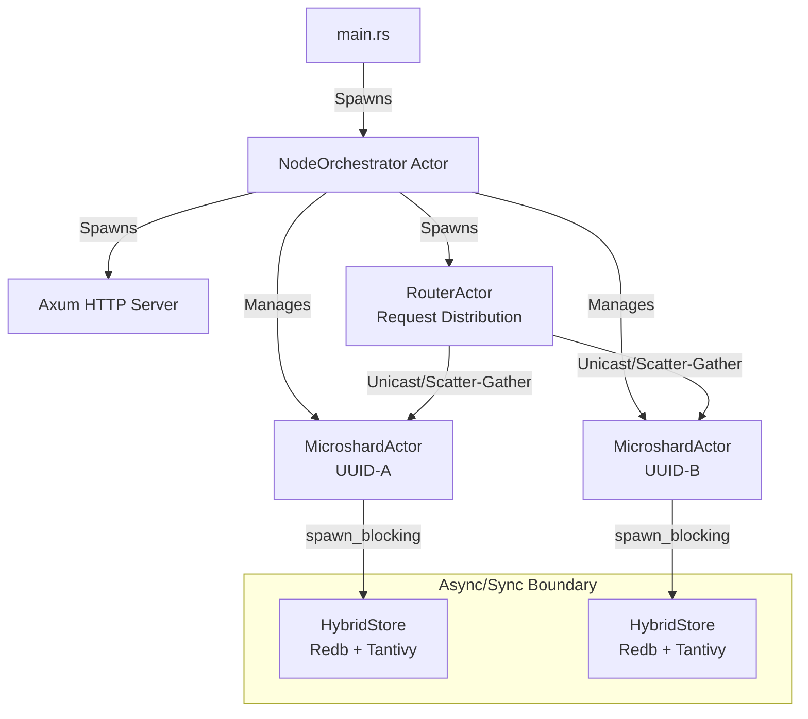
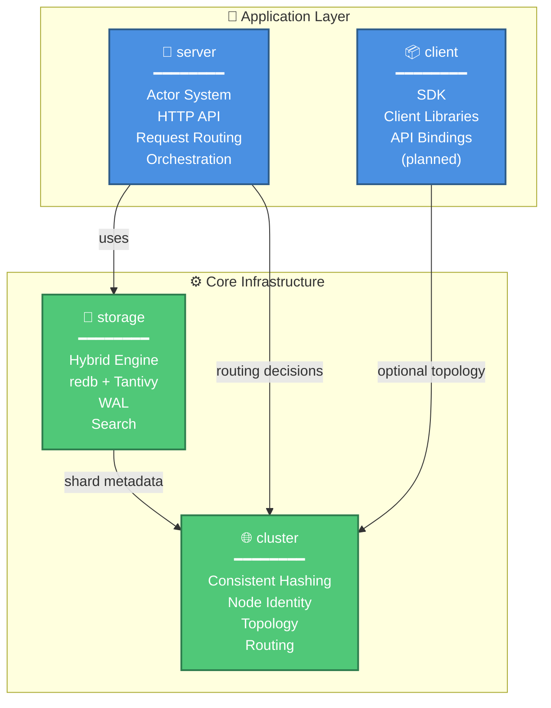

# Distributed Hybrid-Search Database: Architecture Design Document

**Version:** 1.2.0
**Stack:** Rust, Kameo (Actors), Tokio, Redb, Tantivy, Axum
**Crates:** `server`, `storage`, `cluster`, `client`

---

## 1. System Overview

This project is a high-performance, distributed, shared-nothing database and search engine. It utilizes a **Hybrid Storage Architecture** combining a Key-Value store (`redb`) for durability and raw data retrieval, with an Inverted Index engine (`tantivy`) for full-text search capabilities.

The system is designed without a central master ("Leaderless" / "Decentralized"), relying on **Consistent Hashing** and **Distributed Hash Tables (DHT)** for topology management.

### Key Architectural Principles
1.  **State is Emergent:** The cluster state is the aggregate of local states announced by nodes.
2.  **Hybrid Storage:** Every shard is an atomic unit containing both KV storage and Search Indices.
3.  **Smart Routing:** Clients participate in topology awareness; Nodes act as mesh routers.
4.  **Async/Sync Isolation:** Blocking storage operations are properly isolated from async actor runtime.
5.  **Unified Replication:** Migration and Rebalancing are treated as standard replication events.
6.  **Serializable Search:** Search results use JSON serialization for distributed actor communication.

---

## 2. Network Topology & Identity

### 2.1. Node Identity
Nodes are "Self-Sovereign." They do not request an ID from a master.
* **UUID (v4):** The immutable, cryptographic identity of the node.
* **Friendly Name:** A Base36 string derived from the first 2 bytes of the UUID (e.g., `7FX`).
* **Storage:** Identity is generated on Cold Boot and persisted to `./data/cameodb/node_identity.json`.

### 2.2. The Ring (Consistent Hashing)
To ensure uniform data distribution without coordination:
* **Virtual Nodes (VNodes):** Each physical node generates 256 deterministic tokens (`hash(uuid + index)`).
* **Placement:** These tokens are placed on a `u64` hash ring.
* **Ownership:** A key belongs to the first VNode found clockwise on the ring.

### 2.3. Cluster Discovery
* **Mechanism:** Kameo DHT (Kademlia / Libp2p) for distributed node discovery.
* **Bootstrap:** Nodes connect to a seed list for initial cluster join.
* **Announcement:** Nodes publish their UUID and Address to the DHT group `"cluster_nodes"`.
* **Registry:** Each node maintains a local, eventually consistent map of the Cluster Ring based on DHT gossip.
* **Ring Management:** Local consistent hashing with deterministic token generation.

---

## 3. Node Architecture (The Actor System)

The internal structure of a node is hierarchical, managed by the Kameo Actor Framework.



### 3.1. The Node Orchestrator
* **Role:** Local Resource Manager and Parent.
* **Startup:** Scans `./data/cameodb/`. Detects existing shard directories (e.g., `shard-<uuid>`). Spawns `MicroshardActors` for them.
* **Lifecycle:** Handles `ProposeNewShard`, `GetStatus`, and `Shutdown` signals.
* **Resource Guard:** Enforces `max_shards` and disk usage limits before accepting new work.

### 3.2. The RouterActor
* **Role:** Request distribution and result aggregation across the cluster.
* **Routing Logic:**
    - **Unicast:** When `routing_key` is present, uses consistent hashing for targeted delivery to specific shard.
    - **Scatter-Gather:** When no `routing_key`, broadcasts to all shards and aggregates results for global queries.
* **Async Patterns:** Handles concurrent requests with proper async coordination and result serialization.

### 3.3. The MicroshardActor
* **Role:** The atomic unit of data processing with strict async/sync isolation.
* **Threading Model:** All blocking storage operations use `tokio::task::spawn_blocking` to prevent async runtime blocking.
* **State Machine:**
    1.  **`Hosting`:** Active Leader. Writes to local disk, streams to replicas.
    2.  **`Follower`:** Passive Replica. Applies incoming WAL streams.
    3.  **`Forwarding`:** (Soft Handoff) Routes requests to a new owner during/after migration.

---

## 4. Storage Engine: The "Hybrid Shard"

To solve the trade-off between Search (Tantivy) and Retrieval (Redb), both engines run side-by-side within a Shard.

**Directory Structure:**
```text
/data/cameodb/shard-{uuid}/
├── store.redb         # Redb database for KV data and WAL
└── indices/           # Root for multi-tenant Tantivy indices
    ├── {index_name_1}/  # Separate directory for each index
    └── {index_name_2}/  # ...
```

### 4.1. The Atomic Write Transaction
Writes are durable only if committed to Redb. Tantivy is treated as a "View."
1.  **Begin Redb Write Transaction.**
2.  **Insert Data:** Store generic JSON blob in `TABLE_DATA` (Key -> Blob).
3.  **Append Log:** Store operation in `TABLE_WAL` (SeqID -> `WalOp::Put`).
4.  **Commit Redb.** (Data is safe).
5.  **Update Tantivy:** Parse JSON, extract indexed fields, add to Inverted Index.

**Threading Isolation:** All redb and tantivy operations are executed via `tokio::task::spawn_blocking` when called from async actors to maintain runtime performance.

### 4.2. Schema Strategy
* **Schemaless Storage:** Redb stores the full original JSON document for maximum flexibility.
* **Dynamic Indexing:** The ingest pipeline automatically detects and processes field types:
    * `id` -> Primary Key (Redb)
    * `routing_key` -> Sharding Key for consistent hashing
    * `text_fields` -> Tantivy Text fields with standard tokenization
    * `numeric_fields` -> Tantivy FastField for range queries and aggregations

### 4.3. Search Result Serialization
**Design Challenge:** Tantivy documents must be serializable for distributed actor communication.

**Solution:** JSON-based serialization pipeline using tantivy's native conversion:
```rust
// Convert tantivy documents to JSON for network transmission
let doc: TantivyDocument = searcher.doc(doc_address)?;
let json_string = doc.to_json(&schema);  // Native tantivy serialization
let json_doc: JsonValue = serde_json::from_str(&json_string)?;
// Returns Vec<(f32, JsonValue)> - fully serializable for actor messages
```

**Architecture Benefits:**
- **Network Compatibility:** JSON format enables cross-language client support
- **Type Safety:** Maintains Rust's type system throughout the conversion pipeline
- **Performance:** Leverages tantivy's optimized JSON serialization
- **Actor Integration:** `Vec<(f32, JsonValue)>` seamlessly integrates with Kameo message passing

---

## 5. Replication & Consistency

We utilize a **Unified Replication Model**. There is no distinct "Migration" code; migration is simply replication followed by a role switch.

### 5.1. The Protocol
1.  **Handshake:** Follower sends `CurrentSeqID`.
2.  **Snapshot (Cold):** If `CurrentSeqID == 0`, Leader streams:
    * Tantivy Segment Files (Immutable).
    * Redb Key/Value pairs (Iterated).
3.  **Catchup (Warm):** Leader streams live events from `TABLE_WAL`.
4.  **Synced:** Follower is within $N$ milliseconds of Leader.

---

## 6. API Interface (Tantivy-Native)

The system exposes a RESTful API built on **Axum**. It rejects the complexity of the Elasticsearch JSON DSL in favor of the direct **Tantivy Query Language**.

### 6.1. Search Endpoint
* **Method:** `POST /api/{index}/search`
* **Request Body:**
  ```json
  {
    "query": "description:\"distributed database\" AND stars: >500",
    "limit": 20,
    "routing_key": "optional_key_for_unicast"
  }
  ```
* **Routing Architecture:**
  - **Unicast Mode:** With `routing_key`, routes to specific shard via consistent hashing
  - **Scatter-Gather Mode:** Without `routing_key`, broadcasts across all shards and aggregates results
* **Response Format:**
  ```json
  {
    "results": [{"_score": 0.95, "title": "...", "body": "..."}],
    "total_results": 42,
    "successful_shards": 3,
    "failed_shards": 0,
    "query": "search terms"
  }
  ```
* **Query Capabilities:** Full Tantivy query language including Boolean operators (`AND`, `OR`, `-`), Phrase queries (`"foo bar"`), Range queries (`[10 TO 20]`), and Fuzzy matching (`word~1`).

### 6.2. Ingestion Endpoint
* **Method:** `PUT /api/{index}/document`
* **Body:**
  ```json
  {
    "id": "user_123",
    "doc": { "name": "Alice", "role": "admin", "meta": { "login_count": 5 } }
  }
  ```
* **Logic:** The `id` is hashed to determine the target Shard (Unicast). The `doc` is stored raw in Redb and indexed dynamically in Tantivy.

---

## 7. Async/Sync Integration Architecture

### 7.1. Threading Model: Async/Sync Isolation
**Architectural Constraint:** `redb` and `tantivy` are blocking/synchronous libraries, while Kameo actors and Axum operate in async context.

**Design Solution:** Strict isolation boundary using `tokio::task::spawn_blocking`:

```rust
// ✅ CORRECT: Actor method properly isolates blocking calls
async fn handle_search(&self, request: SearchRequest) -> Result<Vec<(f32, JsonValue)>, Error> {
    let store = Arc::clone(&self.store);
    
    // Offload blocking tantivy operations to thread pool
    let results = tokio::task::spawn_blocking(move || {
        store.search_documents(&request.query, request.limit)
    }).await??;
    
    Ok(results) // Can be serialized and sent to other actors
}

// ❌ WRONG: This would block the entire async runtime
async fn bad_example(&self, request: SearchRequest) -> Result<Vec<(f32, JsonValue)>, Error> {
    self.store.search_documents(&request.query, request.limit) // BLOCKS ASYNC RUNTIME!
}
```

### 7.2. HybridStore Thread Safety
* **Design:** `HybridStore` implements `Arc<T> + Send + Sync` for safe sharing
* **IndexWriter:** Protected by `Arc<Mutex<IndexWriter>>` for concurrent access
* **Sequence Counter:** Lock-free `AtomicU64` for WAL sequence generation
* **Pattern:** Clone `Arc<HybridStore>` into blocking tasks

### 7.3. Actor Communication Patterns
```rust
// Scatter-gather search across multiple shards
let mut search_tasks = Vec::new();
for shard_id in &shard_ids {
    let task = tokio::spawn(async move {
        let results = shard.handle_search(search_request).await;
        (shard_id, results)
    });
    search_tasks.push(task);
}

// Aggregate results from all shards
let mut all_results = Vec::new();
for task in search_tasks {
    match task.await {
        Ok((shard_id, Ok(shard_results))) => {
            for (score, doc) in shard_results {
                all_results.push((score, doc, shard_id));
            }
        }
        Ok((shard_id, Err(e))) => warn!("Shard {} failed: {}", shard_id, e),
        Err(e) => warn!("Task failed: {}", e),
    }
}

// Sort by relevance score and return top results
all_results.sort_by(|a, b| b.0.partial_cmp(&a.0).unwrap_or(Ordering::Equal));
all_results.truncate(limit);
```

## 8. Modular Crate Architecture

### 8.1. Modular Design



### 8.2. Crate Responsibilities
- **`server`:** Actor system, HTTP API, request routing, orchestration
- **`storage`:** Hybrid storage engine (redb + tantivy), WAL, search functionality
- **`cluster`:** Consistent hashing, node identity, topology management
- **`client`:** SDK for application integration (planned)

## 9. Resilience & Recovery

### 9.1. Cold Boot / Crash Recovery
1.  **Orchestrator** starts.
2.  **Local Hydration:** Reads `redb` for the last committed WAL Sequence ID.
3.  **Network Join:** Connects to DHT.
4.  **Reconciliation:**
    * Checks if it is still the owner of its shards in the Ring.
    * If yes, opens gates for writes.
    * If no (Cluster rebalanced while dead), enters `Forwarding` mode or deletes data (based on policy).

### 9.2. Zero-Downtime Migration (Soft Handoff)
1.  **Candidate** joins as Follower.
2.  **Sync** completes.
3.  **Orchestrator** issues `Promote`.
4.  **Old Leader** switches to `Forwarding` state (updates internal pointer).
5.  **New Leader** takes over.
6.  **DHT** is updated.
