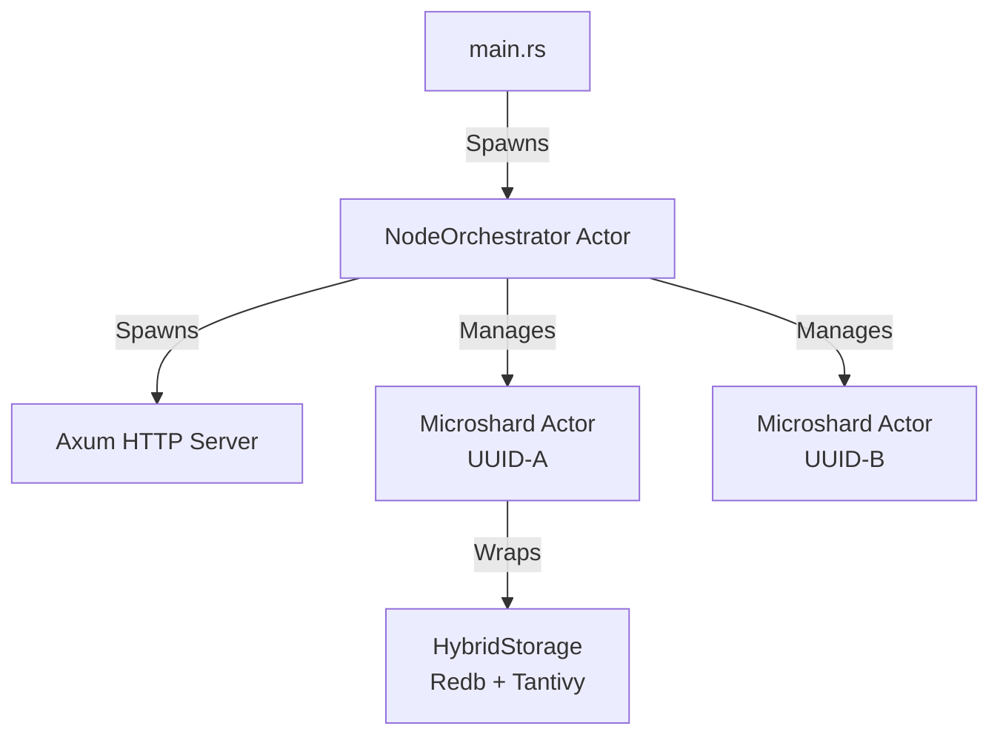

# Distributed Hybrid-Search Database: Architecture Design Document

**Version:** 1.1.0 (Tantivy-Native)
**Status:** Approved for Implementation
**Stack:** Rust, Kameo (Actors), Tokio, Redb, Tantivy, Axum

---

## 1. System Overview

This project is a high-performance, distributed, shared-nothing database and search engine. It utilizes a **Hybrid Storage Architecture** combining a Key-Value store (`redb`) for durability and raw data retrieval, with an Inverted Index engine (`tantivy`) for full-text search capabilities.

The system is designed without a central master ("Leaderless" / "Decentralized"), relying on **Consistent Hashing** and **Distributed Hash Tables (DHT)** for topology management.

### Key Architectural Principles
1.  **State is Emergent:** The cluster state is the aggregate of local states announced by nodes.
2.  **Hybrid Storage:** Every shard is an atomic unit containing both KV storage and Search Indices.
3.  **Smart Routing:** Clients participate in topology awareness; Nodes act as mesh routers.
4.  **Unified Replication:** Migration and Rebalancing are treated as standard replication events.

---

## 2. Network Topology & Identity

### 2.1. Node Identity
Nodes are "Self-Sovereign." They do not request an ID from a master.
* **UUID (v4):** The immutable, cryptographic identity of the node.
* **Friendly Name:** A Base36 string derived from the first 2 bytes of the UUID (e.g., `7FX`).
* **Storage:** Identity is generated on Cold Boot and persisted to `./data/node_meta.json`.

### 2.2. The Ring (Consistent Hashing)
To ensure uniform data distribution without coordination:
* **Virtual Nodes (VNodes):** Each physical node generates 256 deterministic tokens (`hash(uuid + index)`).
* **Placement:** These tokens are placed on a `u64` hash ring.
* **Ownership:** A key belongs to the first VNode found clockwise on the ring.

### 2.3. Cluster Discovery
* **Mechanism:** Kameo DHT (Kademlia / Libp2p).
* **Bootstrap:** Nodes connect to a seed list.
* **Announcement:** Nodes publish their UUID and Address to the DHT group `"cluster_nodes"`.
* **Registry:** Each node maintains a local, eventually consistent map of the Cluster Ring based on DHT gossip.

---

## 3. Node Architecture (The Actor System)

The internal structure of a node is hierarchical, managed by the Kameo Actor Framework.



### 3.1. The Node Orchestrator
* **Role:** Local Resource Manager and Parent.
* **Startup:** Scans `./data/storage/`. Detects existing shard directories (named by UUID). Spawns `MicroshardActors` for them.
* **Lifecycle:** Handles `ProposeNewShard`, `GetStatus`, and `Shutdown` signals.
* **Resource Guard:** Enforces `max_shards` and disk usage limits before accepting new work.

### 3.2. The Microshard Actor
* **Role:** The atomic unit of data processing.
* **State Machine:**
    1.  **`Hosting`:** Active Leader. Writes to local disk, streams to replicas.
    2.  **`Follower`:** Passive Replica. Applies incoming WAL streams.
    3.  **`Forwarding`:** (Soft Handoff) Routes requests to a new owner during/after migration.

---

## 4. Storage Engine: The "Hybrid Shard"

To solve the trade-off between Search (Tantivy) and Retrieval (Redb), both engines run side-by-side within a Shard.

**Directory Structure:**
```text
/data/storage/shard-{uuid}/
├── wal_meta.redb      # The Write-Ahead Log + Raw Data
├── tantivy_idx/       # The Inverted Index files
└── state.json         # Shard-specific config (e.g., replication targets)
```

### 4.1. The Atomic Write Transaction
Writes are durable only if committed to Redb. Tantivy is treated as a "View."
1.  **Begin Redb Write Transaction.**
2.  **Insert Data:** Store generic JSON blob in `TABLE_DATA` (Key -> Blob).
3.  **Append Log:** Store operation in `TABLE_WAL` (SeqID -> `WalOp::Put`).
4.  **Commit Redb.** (Data is safe).
5.  **Update Tantivy:** Parse JSON, extract indexed fields, add to Inverted Index.

### 4.2. Schema Strategy
* **Schemaless Storage:** Redb stores the full original JSON.
* **Dynamic Indexing:** The Ingest logic detects fields.
    * `id` -> Primary Key (Redb).
    * `routing_key` -> Sharding Key.
    * `text_fields` -> Tantivy Text (Standard Tokenizer + Ngram).
    * `numeric_fields` -> Tantivy FastField.

---

## 5. Replication & Consistency

We utilize a **Unified Replication Model**. There is no distinct "Migration" code; migration is simply replication followed by a role switch.

### 5.1. The Protocol
1.  **Handshake:** Follower sends `CurrentSeqID`.
2.  **Snapshot (Cold):** If `CurrentSeqID == 0`, Leader streams:
    * Tantivy Segment Files (Immutable).
    * Redb Key/Value pairs (Iterated).
3.  **Catchup (Warm):** Leader streams live events from `TABLE_WAL`.
4.  **Synced:** Follower is within $N$ milliseconds of Leader.

---

## 6. API Interface (Tantivy-Native)

The system exposes a RESTful API built on **Axum**. It rejects the complexity of the Elasticsearch JSON DSL in favor of the direct **Tantivy Query Language**.

### 6.1. Search Endpoint
* **Method:** `POST /api/:index/search`
* **Body:**
  ```json
  {
    "query": "description:\"distributed database\" AND stars: >500",
    "limit": 20
  }
  ```
* **Logic:** The `query` string is passed directly to the `Microshard`'s `QueryParser`.
* **Capabilities:** Supports Boolean operators (`AND`, `OR`, `-`), Phrase queries (`"foo bar"`), Ranges (`[10 TO 20]`), and Fuzzy matching (`word~1`).

### 6.2. Ingestion Endpoint
* **Method:** `PUT /api/:index/document`
* **Body:**
  ```json
  {
    "id": "user_123",
    "doc": { "name": "Alice", "role": "admin", "meta": { "login_count": 5 } }
  }
  ```
* **Logic:** The `id` is hashed to determine the target Shard (Unicast). The `doc` is stored raw in Redb and indexed dynamically in Tantivy.

---

## 7. Resilience & Recovery

### 7.1. Cold Boot / Crash Recovery
1.  **Orchestrator** starts.
2.  **Local Hydration:** Reads `redb` for the last committed WAL Sequence ID.
3.  **Network Join:** Connects to DHT.
4.  **Reconciliation:**
    * Checks if it is still the owner of its shards in the Ring.
    * If yes, opens gates for writes.
    * If no (Cluster rebalanced while dead), enters `Forwarding` mode or deletes data (based on policy).

### 7.2. Zero-Downtime Migration (Soft Handoff)
1.  **Candidate** joins as Follower.
2.  **Sync** completes.
3.  **Orchestrator** issues `Promote`.
4.  **Old Leader** switches to `Forwarding` state (updates internal pointer).
5.  **New Leader** takes over.
6.  **DHT** is updated.
