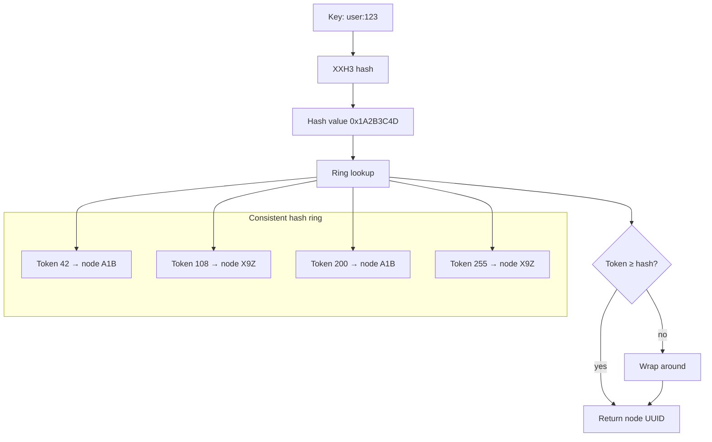
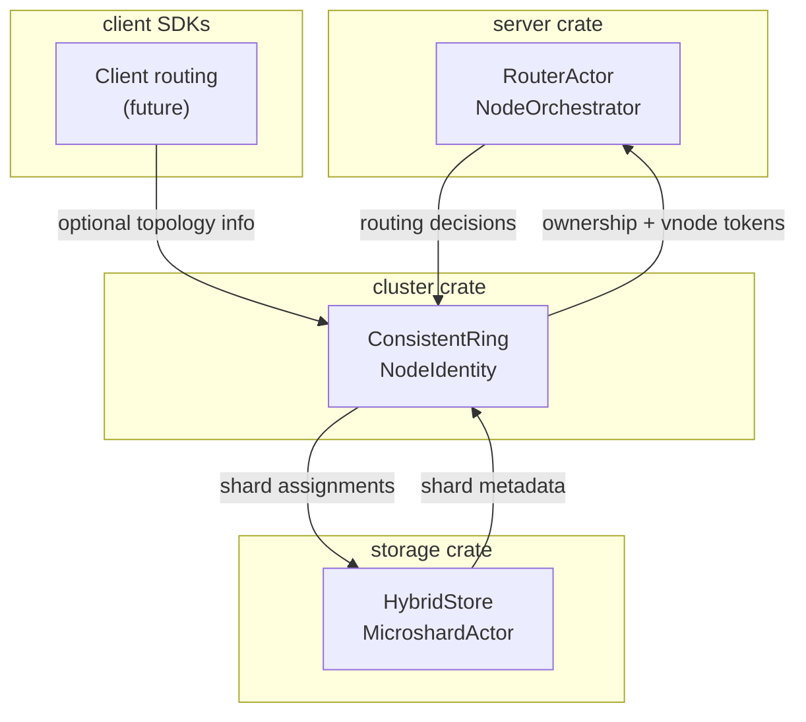

# Cluster - Distributed Topology for CameoDB

The `cluster` crate provides the foundational topology logic for CameoDB's distributed architecture, implementing consistent hashing for data distribution and node identity management.

## Self-Sovereign Identity

Each CameoDB node maintains a **self-sovereign identity** consisting of:

### UUID (Universally Unique Identifier)
- Generated using UUID v4 (random)
- Provides global uniqueness across all nodes
- Used as the canonical node identifier
- Example: `550e8400-e29b-41d4-a716-446655440000`

### Friendly Name (Base36)
- 3-character identifier derived from the first 2 bytes of the UUID
- Uses Base36 encoding (0-9, A-Z) for compactness
- Zero-padded to ensure exactly 3 characters
- Examples: `A1B`, `X9Z`, `007`

### Node Label (Human-Readable)
- Optional human-friendly name configured via `node.label`
- Used for logging, dashboards, and operational visibility
- Example: `cameodb-node-1`

**Algorithm:**
```rust
fn humanize_uuid(uuid: &Uuid) -> String {
    let bytes = uuid.as_bytes();
    let prefix = u16::from_be_bytes([bytes[0], bytes[1]]) as u32;
    let encoded = to_base36(prefix);
    // Zero-pad to 3 characters
    format!("{:0>3}", encoded)
}
```

This provides operators with memorable node names while maintaining global uniqueness through the underlying UUID.

## Virtual Node (VNode) Strategy

CameoDB uses **256 virtual nodes per physical node** to ensure even data distribution across the cluster.

### Why 256 VNodes?

| VNode Count | Pros | Cons |
|-------------|------|------|
| 64 | Low memory overhead | Uneven distribution with small clusters |
| **256** | **Good balance** | **Moderate memory usage** |
| 1024 | Excellent distribution | High memory overhead |

**256 VNodes** provides the optimal balance between:
- **Distribution Quality**: Sufficient virtual nodes for even load distribution
- **Memory Overhead**: Reasonable memory usage (256 × 8 bytes = 2KB per node)
- **Rebalancing Efficiency**: Only ~1/N keys move when adding/removing nodes

### Token Generation Algorithm

Each virtual node token is generated deterministically using XXH3:

```rust
fn generate_tokens(uuid: Uuid) -> Vec<u64> {
    (0..256).map(|index| {
        let mut hasher = xxh3::Xxh3::new();
        hasher.update(uuid.as_bytes());      // Node identity
        hasher.update(&index.to_be_bytes()); // VNode index
        hasher.digest()
    }).collect()
}
```

**Properties:**
- **Deterministic**: Same UUID always produces same tokens
- **Well-Distributed**: XXH3 provides excellent hash distribution
- **Fast**: Optimized for modern CPUs

## Consistent Hashing Flow

The following diagram shows how keys are routed to nodes:



### Routing Algorithm

1. **Hash the Key**: `XXH3(key) → u64`
2. **Ring Lookup**: Find first token ≥ hash value using `BTreeMap::range(hash..)`
3. **Wrap-Around**: If no token found, use first token in ring
4. **Return Owner**: Return UUID associated with the token

```rust
pub fn get_owner(&self, key: &str) -> Option<Uuid> {
    if self.ring.is_empty() {
        return None;
    }

    let hash = hash_key(key.as_bytes());
    
    self.ring
        .range(hash..)           // Find tokens >= hash
        .map(|(_, uuid)| *uuid)
        .next()                  // First match
        .or_else(|| self.ring.values().copied().next()) // Wrap around
}
```

## Key Features

### Consistency
- Same key always routes to same node (when topology is stable)
- Deterministic token generation ensures reproducible behavior
- No coordination required for routing decisions

### Load Balancing
- 256 virtual nodes per physical node ensure even distribution
- Statistical distribution approaches perfect balance with more nodes
- Handles heterogeneous key distributions well

### Minimal Rebalancing
- Only ~1/N keys move when adding/removing nodes
- Virtual nodes minimize the impact of topology changes
- No global rebalancing required

### Fault Tolerance
- No single point of failure
- Nodes can join/leave independently
- Ring state is eventually consistent across all nodes

## Usage Examples

### Basic Usage

```rust
use cluster::{NodeIdentity, ConsistentRing};
use std::path::PathBuf;

// Create or load node identity
let identity = NodeIdentity::load_or_create(PathBuf::from("./data/meta.json"))?;
println!("Node: {} ({})", identity.name, identity.uuid);

// Set up consistent hash ring
let mut ring = ConsistentRing::new();
ring.add_node(&identity);

// Route keys to nodes
let owner = ring.get_owner("user:123");
println!("Key 'user:123' belongs to: {:?}", owner);
```

### Multi-Node Cluster

```rust
use cluster::{NodeIdentity, ConsistentRing};

let mut ring = ConsistentRing::new();

// Add multiple nodes (each gets unique UUID and 3-char name)
let node_a = NodeIdentity::new(); // e.g., "A1B" (from UUID bytes)
let node_b = NodeIdentity::new(); // e.g., "X9Z" (from UUID bytes)
let node_c = NodeIdentity::new(); // e.g., "M7K" (from UUID bytes)

ring.add_node(&node_a);
ring.add_node(&node_b);
ring.add_node(&node_c);

// Keys distribute across nodes
let keys = ["user:1", "user:2", "user:3", "order:100", "product:50"];
for key in &keys {
    let owner = ring.get_owner(key).unwrap();
    println!("{} → {}", key, owner);
}
```

### Dynamic Membership

```rust
use cluster::{NodeIdentity, ConsistentRing};

let mut ring = ConsistentRing::new();
let node_a = NodeIdentity::new();
let node_b = NodeIdentity::new();

// Initial cluster
ring.add_node(&node_a);
ring.add_node(&node_b);

let key = "important:data";
let initial_owner = ring.get_owner(key);

// Add new node
let node_c = NodeIdentity::new();
ring.add_node(&node_c);

let new_owner = ring.get_owner(key);
// Only ~1/256 chance key moves to new node (minimal rebalancing)

// Remove node
ring.remove_node(&node_a.uuid);
let final_owner = ring.get_owner(key);
// Key automatically reassigned to next node in ring if it was on removed node
```

## Performance Characteristics

- **Lookup Time**: O(log N) where N = number of virtual tokens (256 × nodes)
- **Memory Usage**: O(N) for token storage (~2KB per node)
- **Rebalancing**: Only ~1/N keys move when adding/removing nodes
- **Hash Quality**: XXH3 provides excellent distribution properties

## Shared-Nothing Architecture Integration

The cluster crate enables CameoDB's **shared-nothing architecture** by providing topology-aware routing that integrates seamlessly with the storage engine and actor system:

### Request Routing Pattern

```rust
use cluster::ConsistentRing;
use storage::HybridStore;

// Determine which shard should handle a key
let ring = ConsistentRing::new();
// ... populate ring with nodes ...

let owner = ring.get_owner("user:123");
if owner == Some(local_node.uuid) {
    // Handle locally
    local_store.apply_write(operation)?;
} else {
    // Forward to remote node via actor system
    forward_to_node(owner, operation)?;
}
```

### Unicast vs Scatter-Gather Routing

#### Unicast (With routing_key)
```rust
// When routing_key is present, use consistent hashing for targeted delivery
let target_node = ring.get_owner(&routing_key);
send_to_single_node(target_node, request).await?;
```

#### Scatter-Gather (No routing_key)
```rust
// When no routing_key, broadcast to all shards and aggregate results
let all_nodes = ring.get_all_nodes();
let futures: Vec<_> = all_nodes.iter()
    .map(|node| send_to_node(*node, request.clone()))
    .collect();
    
let results = futures::future::join_all(futures).await;
let aggregated = aggregate_results(results)?;
```

### Actor System Integration

The cluster topology works with CameoDB's actor-based architecture:

```rust
// RouterActor uses consistent hashing for request distribution
impl RouterActor {
    pub async fn handle_client_op(&self, op: ClientOp) -> Result<JsonValue, Error> {
        match op {
            ClientOp::Search { index, query, routing_key, .. } => {
                if let Some(key) = routing_key {
                    // Unicast: Route to specific shard
                    let target = self.ring.get_owner(&key);
                    self.send_to_shard(target, SearchRequest { query }).await
                } else {
                    // Scatter-Gather: Search across all shards
                    let results = self.scatter_gather_search(query).await?;
                    self.aggregate_search_results(results)
                }
            }
        }
    }
}
```

## Distributed System Properties

### Consistency Model
- **Eventual Consistency**: Ring membership is eventually consistent across nodes
- **Deterministic Routing**: Given the same ring state, routing is deterministic
- **No Global State**: Each node maintains its own view of the cluster topology

### Partition Tolerance
- **Network Partitions**: Nodes can operate independently during network splits
- **Split-Brain Handling**: Each partition continues serving requests for its keys
- **Healing**: Partitions automatically heal when network connectivity is restored

### Availability
- **No SPOF**: No single point of failure in the routing layer
- **Graceful Degradation**: System remains available even if some nodes are unreachable
- **Fast Recovery**: New nodes can join without global synchronization

## Advanced Features

### Virtual Node Distribution Analysis

The choice of 256 virtual nodes provides optimal distribution characteristics:

```rust
// Distribution quality metrics
let distribution_variance = calculate_load_variance(&ring);
let rebalance_efficiency = calculate_rebalance_ratio(&ring);

// With 256 VNodes:
// - Variance: < 5% for clusters with 10+ nodes
// - Rebalance: Only ~0.39% of keys move per node addition
```

### Node Weight Support (Future)

```rust
// Planned: Support for heterogeneous node capacities
let mut ring = ConsistentRing::new();
ring.add_weighted_node(&small_node, 1.0);   // 1x capacity
ring.add_weighted_node(&large_node, 4.0);   // 4x capacity
// Large node gets ~4x more virtual tokens
```

### Rack-Aware Placement (Future)

```rust
// Planned: Ensure replicas are distributed across failure domains
let placement = ring.get_replicas("user:123", replication_factor=3)
    .with_rack_awareness()
    .with_datacenter_awareness();
```

## Integration with Storage Engine

```rust
use cluster::ConsistentRing;
use storage::HybridStore;

// Determine which shard should handle a key
// This routing logic is handled by the RouterActor in the server crate
// See the "Shared-Nothing Architecture Integration" section above for details
```

## Testing

The crate includes comprehensive tests covering:

- **Basic Operations**: Node addition, key routing
- **Wrap-Around Behavior**: Keys with high hash values
- **Node Removal**: Key redistribution after node removal
- **Distribution Quality**: Statistical distribution across multiple nodes
- **Deterministic Behavior**: Same inputs produce same outputs

Run tests with:
```bash
# Run all cluster tests
cargo test -p cluster

# Run specific test suites
cargo test -p cluster test_consistent_hashing
cargo test -p cluster test_node_identity
cargo test -p cluster test_ring_operations
```

### Test Coverage
- **Identity Generation**: Node UUID and name generation
- **Hash Distribution**: Statistical analysis of key distribution
- **Ring Operations**: Add/remove nodes, key routing
- **Edge Cases**: Empty rings, wrap-around behavior, collision handling
- **Performance**: Benchmark routing latency and memory usage

## Future Enhancements

### Near-term
- **Weighted Nodes**: Support for nodes with different capacities based on hardware specs
- **Membership Events**: Callbacks for node join/leave events
- **Health Integration**: Remove unhealthy nodes from routing decisions

### Long-term
- **Rack Awareness**: Ensure replicas are distributed across failure domains
- **Dynamic Rebalancing**: Automatic rebalancing based on load metrics and hotspots
- **Gossip Protocol**: Distributed membership management without coordination
- **Topology Optimization**: Machine learning-based placement optimization
- **Global Load Balancing**: Cross-datacenter request routing

## Relationship to Other Crates



- **server**: Uses cluster for request routing in RouterActor
- **storage**: Sharding decisions based on cluster topology
- **client**: May use cluster knowledge for client-side routing optimization
