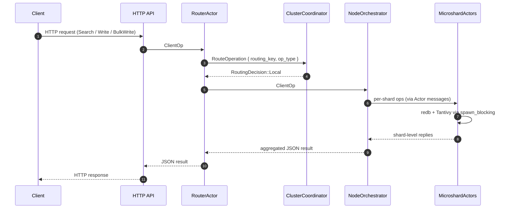
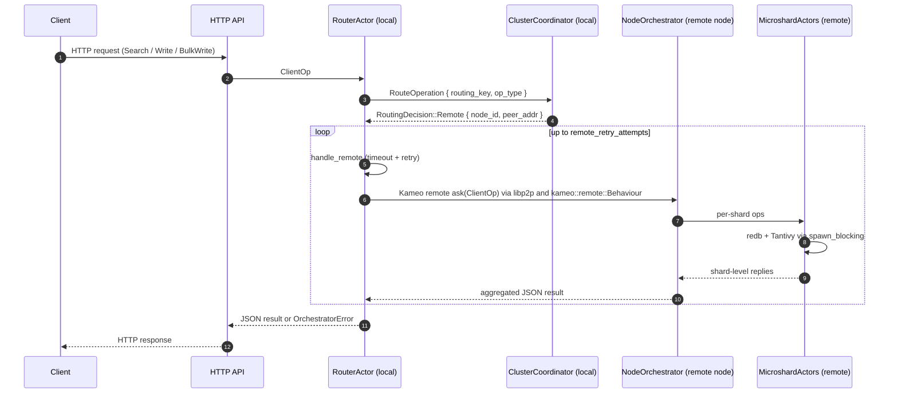
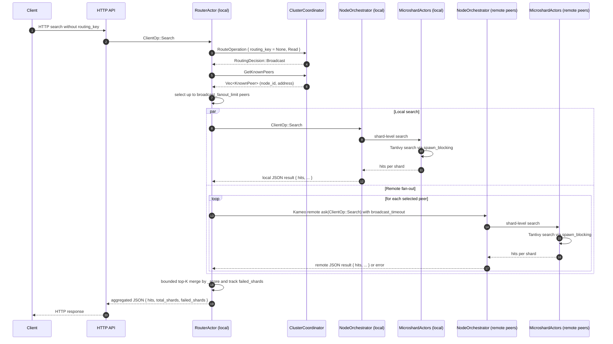

# CameoDB Node

The `server` crate hosts the CameoDB node process: a high-performance, actor-based database node that combines local hybrid storage (redb + Tantivy) with distributed coordination, routing, and remote execution over libp2p + Kameo.

This document focuses on the *node-side* architecture and the distributed workflows currently implemented.

---

## 1. Core Responsibilities

- **HTTP API surface**
  - Routes: `/api/{index}/search` (JSON), `/api/{index}/search/stream` (NDJSON, JSON fallback), `/api/{index}/document` (PUT), `/api/{index}/document/stream` (NDJSON), `/api/{index}/_bulk` (POST), `/api/{index}/_config` (GET/PUT), `/api/{index}/_schema` (PATCH), `/api/{index}` (DELETE), `/_indexes`, `/_cluster/_indexes`, `/_cluster/health`.
  - MCP Routes: `/mcp` (POST - direct HTTP JSON-RPC), `/mcp/sse` (GET - SSE transport, POST - compatibility), `/mcp/messages?session_id=...` (POST - SSE message endpoint).
  - Translates requests into strongly-typed operations (`ClientOp`) and hands them to `RouterActor`.
  - Middleware: compression/decompression, trace, permissive CORS, request body limit; ConnectInfo enabled at serve for client addr extraction.
- **Local orchestration**
  - Manages microshards (`MicroshardActor`) and their storage configuration.
  - Ensures all redb/tantivy I/O is executed via `tokio::task::spawn_blocking`.
- **Cluster coordination**
  - Manages the libp2p swarm and Kademlia DHT.
  - Tracks peer nodes, shard ownership, and consistent-hash routing.
- **Distributed execution**
  - Uses Kameo remote actors over libp2p to forward operations to remote nodes.
  - Implements scatter–gather broadcast for search and multi-node writes.

---

## 2. Main Actors & Data Flow

### 2.1 RouterActor

The `RouterActor` is the primary ingress for database operations on a node.

- Input: `ClientOp`, representing logical client operations:
  - `Search { index, query, limit, fields, sort }` - Search with optional field projection and sorting
  - `Stream { index, query, limit, fields, sort }` - Streaming search with optional field projection and sorting
  - `Write { index, id, routing_key, doc }` - Single document write
  - `BulkWrite { index, docs }` - Batch document write
  - `CreateConfig { index, schema }`, `GetConfig { index }` (Schema management)
  - `ListIndexes { include_data_size }`, `ListClusterIndexes { include_data_size }` (Metadata)
  - `GetIdentity` (Node identity information)
  - `DeleteIndex { index, delete_schema }` (Index Management)
- Responsibilities:
  - Ask the `ClusterCoordinator` for a routing decision:
    - `RoutingDecision::Local`
    - `RoutingDecision::Remote { node_id, peer_addr }`
    - `RoutingDecision::Broadcast`
  - Execute the chosen path:
    - Local → delegate to `NodeOrchestrator` on this node via the hot-path worker pool when eligible.
    - Remote → call `handle_remote` / `try_remote` with retries + timeouts.
    - Broadcast → fan out to local + remote nodes with bounded concurrency and aggregate results using score-aware top-K merging.
- Telemetry:
  - Tracks broadcast attempts and failures via `AtomicU64` counters.

### 2.2 NodeOrchestrator

`NodeOrchestrator` owns the node’s identity and all local shards.

- **Core Fields:**
  - `identity: NodeIdentity` (UUID, name, vnode tokens)
  - `shards: HashMap<Uuid, MicroshardActor>` (all local microshards)
  - `routing_ring: ConsistentRing` (for shard placement)
  - `config: NodeConfig` (node configuration)
  - `coordinator: Option<ActorRef<ClusterCoordinator>>` (for shard registration)
- **Performance Optimizations:**
  - `schema_cache: Arc<ArcSwap<HashMap<String, Arc<IndexSchema>>>>` (lock-free schema cache)
  - `fingerprint_index: Arc<ArcSwap<HashMap<u64, String>>>` (reverse lookup for cache hits)
  - `engine: Option<Arc<OrchestratorEngine>>` (shared lock-free state for worker pool)
  - `worker_tx: Option<OrchestratorWorkerTx>` (hot-path worker pool for Write/Search operations)
  - `read_runtime: Option<Arc<tokio::runtime::Runtime>>` (dedicated runtime for read I/O isolation)
  - `remote_peer_pool: Option<Arc<RemotePeerPool>>` (cached remote actor references)
- **Startup:**
  - Hydrates existing shards from disk
  - Registers shard assignments with `ClusterCoordinator`
  - Spawns worker pool for concurrent hot-path operations
- **Message handling:**
  - `Message<ClientOp>` delegates to `handle_client_op` or worker pool
  - Hot-path operations (Write, Search) bypass actor mailbox via worker pool
  - Uses `spawn_blocking` for all redb/tantivy calls
- **Remote capability:**
  - `#[derive(Actor, RemoteActor)]`
  - `#[remote_message("cameo.orchestrator.client_op")] impl Message<ClientOp>` enables remote `ask`

### 2.3 MicroshardActor

Each `MicroshardActor` manages a single shard’s data and index.

- Storage:
  - redb for durable KV and WAL.
  - Tantivy for full-text search.
- Remote messages:
  - `SearchRequest` → `Result<SearchReply, RemoteError>`.
  - `WriteRequest` → `Result<WriteReply, RemoteError>`.
  - `BatchWriteRequest` → `Result<BatchWriteReply, RemoteError>`.
- All storage operations are executed inside `spawn_blocking` to avoid blocking async executors.

### 2.4 ClusterCoordinator & DistributedCluster

`ClusterCoordinator` owns a `DistributedCluster` and exposes cluster operations via actor messages.

- **Core State**:
  - `cluster: DistributedCluster` - The underlying distributed cluster instance
  - `shard_assignments: HashMap<Uuid, ShardMetadata>` - Which shards live on which nodes
  - `ring: ConsistentRing` - Used for consistent hashing
  - `state: ClusterState` - Current cluster health (`Active`, `Degraded`, `Failed`)
  - `expected_nodes: HashMap<Uuid, NodeInfo>` - Authoritative registry of all known cluster nodes (active or disconnected)
  - `expected_shards: HashMap<Uuid, ShardMetadata>` - Shards expected from snapshot for reconciliation
  - `generation: u64` - Cluster state generation number for versioning
  - `state_store: Option<Arc<ClusterStateStore>>` - Persistent metadata storage (metadata.redb)
  - `local_orchestrator: Option<ActorRef<NodeOrchestrator>>` - Reference to local orchestrator for coordinated operations
  - `topology_subscribers: Vec<mpsc::Sender<ConsistentRing>>` - Subscribers for topology updates
  - `remote_peer_pool: Option<Arc<RemotePeerPool>>` - Cached remote actor references

- **Key Messages**:
  - `InitSwarm` / `ShutdownSwarm` - Swarm lifecycle.
  - `DiscoverPeers`, `GetStatus` - Cluster observability.
  - `RegisterLocalShards` + `rebuild_ring()` - Maintain shard metadata.
  - `RouteOperation` → `RoutingDecision` - Read/write routing.
  - `GetKnownPeers` → `Vec<KnownPeer>` - Broadcast fan-out.
  - `PeerDiscovered` / `PeerLost` - Membership events trigger state transitions.
  - `MergeRemoteShards` - Reconcile remote node shard reports with local expectations.

- **Event-Driven State Management**:
  - No background polling or timeouts.
  - State transitions occur only on membership events (`PeerDiscovered`, `PeerLost`).
  - Cluster metadata persisted inline with state changes to `metadata.redb`.
  - Pure Kameo actor message-driven lifecycle.

---

## 3. Networking & Remote Actors

### 3.1 Libp2p Swarm & Kademlia

The node builds a custom libp2p swarm with:

- TCP (nodelay), QUIC, Noise, Yamux.
- Kademlia DHT for peer discovery and routing metadata.
- Custom `DhtBehaviour`:
  - `kademlia: kad::Behaviour<MemoryStore>`.
  - `kameo: kameo::remote::Behaviour`.

After the swarm is built, the code calls:

```rust
swarm.behaviour_mut().kameo.init_global();
```

This wires Kameo’s remote registry into the swarm so actor lookups and remote messaging flow over libp2p.

### 3.2 Remote Actor Naming & Registration

To make nodes discoverable for remote calls, CameoDB uses stable actor names:

- `orchestrator-{node_id}` for `NodeOrchestrator`.
- `shard-{shard_id}` for `MicroshardActor` (planned for direct shard-to-shard calls).

On startup, after `NodeOrchestrator` is spawned, the node:

1. Computes the name using `orchestrator_remote_name(node_id)`.
2. Calls `orchestrator_ref.register(name).await` to register with the Kameo registry.

### 3.3 Remote Call Path (`RouterActor::try_remote`)

When `ClusterCoordinator` decides that an operation should be routed to a remote node:

1. `RouterActor::handle_remote` applies retries and timeouts.
2. Each attempt calls `RouterActor::try_remote`:
   - Builds the orchestrator name from the target node’s UUID.
   - Uses `RemoteActorRef::<NodeOrchestrator>::lookup(name).await`.
   - On success, forwards the original `ClientOp` with `remote.ask(&op).await`.
3. Errors and timeouts are logged and converted into `OrchestratorError`.

This path reuses the same `ClientOp` semantics on remote nodes as on the local node.

---

## 4. Routing & Distribution Semantics

### 4.1 Single-Key Read/Write Routing

For **writes**, the system derives an effective `routing_key` using the following priority:

1. **Explicit routing_key from the client payload** (if provided).
2. **Document id field**: if the JSON document has an `"id"` field, that value is used.
3. **Derived key from document bytes**: if neither of the above is present, the document is
   serialized to JSON, hashed using XXH3-64, and hex-encoded into a stable key.

This effective key is then used consistently across the cluster:

1. `RouterActor` sends `RouteOperation { routing_key, operation_type }` to `ClusterCoordinator`.
2. `ClusterCoordinator::decide_route`:
   - Uses `ConsistentRing::get_owner(key)` (XXH3 based) to map key → `shard_id`.
   - Uses `shard_owner(shard_id)` to map `shard_id` → `node_id`.
   - Looks up node address in `peer_nodes`.
   - Returns:
     - `RoutingDecision::Local` if the owner node is the local node.
     - `RoutingDecision::Remote { node_id, peer_addr }` if a remote owner is known.
     - `RoutingDecision::Broadcast` if metadata is missing.
3. `RouterActor` executes the routing decision:
   - Local: calls `NodeOrchestrator` directly.
   - Remote: uses Kameo remote actors as described above.
   - Broadcast: falls through to scatter–gather.

This gives you single-owner semantics for keyed **writes** across the cluster while still
providing a deterministic, evenly distributed fallback when clients do not specify a
routing key explicitly.

**Metadata operations** (`GetConfig`, `CreateConfig`, `ListIndexes`) always execute locally on the node handling the HTTP request. They do not broadcast or remote, since schema/config data is available via the local `HybridStore`.

**Cluster-wide Metadata** (`ListClusterIndexes`) is an exception: it broadcasts to all nodes to aggregate index statistics and shard counts across the cluster.

Schema metadata is cached per node inside `NodeOrchestrator` to avoid repeated redb reads on every request. The cache is populated on first read (`_config`), updated on schema evolution or `CreateConfig`, and returned on subsequent requests with fields sorted (`id` first, others alphabetical).

### 4.2 Broadcast / Scatter–Gather

When there is **no routing_key**, or the coordinator chooses `Broadcast` because of missing metadata, the router performs a scatter–gather:

1. Ask `ClusterCoordinator` for known peers via `GetKnownPeers`.
2. Select up to `broadcast_fanout_limit` peers.
3. Execute in parallel:
   - Local `handle_client_op` over local microshards, with shard-level concurrency bounded by `max_concurrent_shard_searches`.
   - Remote `try_remote` calls to selected peers, each wrapped in `timeout(broadcast_timeout, ...)` and bounded by `max_concurrent_remote_searches`.
4. Aggregate results:
    - **Search**:
      - Collect `hits` arrays from successful responses.
      - Merge into a bounded score-aware top-K set capped by the requested limit.
      - Allow later higher-scoring remote hits to displace weaker early hits.
      - Report `hits_returned`, `total_hits`, `limit`, plus `total_shards` and `failed_shards`.
   - **Write/BulkWrite**:
     - Report number of nodes contacted, succeeded, and failed.
   - Other operations:
     - Return first successful result or an aggregated failure.
5. Update `broadcasts_total` and `broadcast_failures` telemetry counters.

This implements a distributed search/read path suitable for fan-out queries across nodes while preserving timeouts, bounded concurrency, and bounded in-memory result merging.

---

## 5. Error Handling & Telemetry

- **Error types**:
  - `OrchestratorError` for node-level orchestration failures.
  - `RemoteError` for remote microshard call failures.
  - Conversions are implemented so remote errors can be surfaced as orchestrator errors.
- **Retries & timeouts**:
  - Remote routing uses bounded retries (`remote_retry_attempts`) and per-attempt `remote_timeout`.
  - Broadcast uses `broadcast_timeout` per remote call.
- **Telemetry**:
  - Broadcast paths track:
    - Total broadcast attempts.
    - Broadcast failures (per failed shard/node).

### Graceful Shutdown

CameoDB implements a 4-phase graceful shutdown process with configurable timeouts:

| Phase | Operation | Timeout | Critical |
|-------|-----------|---------|----------|
| 1 | Close MCP sessions | 5s | No |
| 2 | Drain HTTP connections | 10s | No |
| 3 | Shutdown all shards | 60s | **Yes** |
| 4 | Shutdown coordinator | 10s | No |

**Phase 3 (Shard Shutdown) includes:**
- Commit any pending Tantivy writes with data durability
- Flush redb WAL via `Durability::Immediate` transaction
- Clear all in-memory caches
- Stop writer threads

**Signal Handling:**
- First SIGINT/Ctrl+C initiates graceful shutdown
- Second SIGINT forces immediate exit (may lose uncommitted data)
- Windows: Handles CTRL_CLOSE and CTRL_SHUTDOWN for service stop events

This ensures clean state for fast startup (zero WAL replay) on next boot.

---

## 6. Cluster Metadata Persistence & State Reconciliation

### 6.1 Event-Driven Persistence

Cluster metadata is persisted to `metadata.redb` using a **zero-polling, event-driven** approach:

- **No background tasks** - All persistence triggered inline with state-changing actor messages.
- **No timeouts** - State transitions occur only on actual membership events.
- **Message-driven lifecycle** - Fully aligned with Kameo actor model.
- **Serialization format** - All metadata is serialized as JSON (`serde_json`) for unified, debuggable persistence. Deserialization errors on startup are treated as fresh cluster state (graceful upgrade from older formats).

**Persistence Triggers:**
- `PeerDiscovered` → Update node registry, evaluate cluster state, persist snapshot.
- `PeerLost` → Mark node inactive, transition state (e.g., Active → Degraded), persist.
- `MergeRemoteShards` → Reconcile shard metadata, update assignments, persist.

**Persisted Data (`metadata.redb` tables):**
- `cluster_config` - Generation number, expected node count, last stable timestamp.
- `shard_assignments` - Per-shard metadata (node owner, vnode tokens, document count, storage bytes).
- `node_registry` - Node info (UUID, address, shard count, first/last seen timestamps).
- `ring_snapshot` - (Reserved for future ring serialization optimization).

### 6.2 State Reconciliation on Boot

When a node restarts with persisted metadata, it performs **snapshot-vs-reality reconciliation**:

**Boot Sequence:**
1. Load `metadata.redb` → `PersistedClusterTopology`.
2. Extract `expected_nodes` (nodes from last run) → mark as Inactive.
3. Extract `expected_shards` (shard assignments from snapshot) → store for comparison.
4. Set initial state to `Degraded` (only local node active, others expected).
5. Wait for peer discovery via libp2p Kademlia.

**Reconciliation on Peer Join:**
When a remote node sends `PeerDiscovered` and reports its shards via `MergeRemoteShards`:

1. **Compare** actual reported shards vs expected shards from snapshot.
2. **Categorize**:
   - **Matched**: Shard exists, metadata unchanged (document count, storage bytes match).
   - **Changed**: Shard exists but metadata differs (e.g., +200 docs since last shutdown).
   - **Added**: Shard not in snapshot (new shard created on remote node).
   - **Missing**: Expected from snapshot but not reported (possible data loss or migration).
3. **Log** detailed reconciliation results for operational visibility.
4. **Accept** remote node's reported state as source of truth.
5. **Persist** reconciled cluster topology to `metadata.redb`.

**Example Reconciliation Log:**
```
INFO ClusterCoordinator: reconciling node state with snapshot
  node=b2c3d4e5-... matched=1 added=1 changed=1 missing=1

INFO New shards not in snapshot
  node=b2c3d4e5-... shards=[shard-uuid-4]

INFO Shard state changed since snapshot
  node=b2c3d4e5-... shard=shard-uuid-1
  expected_docs=1000 actual_docs=1200
  expected_bytes=5242880 actual_bytes=6291456

WARN Expected shards from snapshot not reported by node
  node=b2c3d4e5-... shards=[shard-uuid-3]
```

### 6.3 Cluster State Machine

Simplified reactive state machine with three states:

- **Active** - All expected nodes present and healthy.
- **Degraded** - Some expected nodes inactive or missing.
- **Failed** - Too few nodes to operate reliably (< 50% quorum).

**State Transitions:**
- `PeerDiscovered` → May transition Degraded → Active if all nodes rejoined.
- `PeerLost` → May transition Active → Degraded or Degraded → Failed.
- No waiting states, no timeouts - purely reactive to membership events.

---

## 7. Date Field Handling & Indexing

CameoDB provides flexible date handling that accepts multiple input formats during writes and automatically normalizes them for Tantivy indexing while preserving the original JSON in redb.

### 7.1 Write Path: Date Normalization

When documents are indexed with date fields, the storage layer (`crates/storage`) automatically detects and normalizes various date formats:

**Supported Input Formats:**
- **RFC3339 with timezone**: `2024-01-05T12:00:00Z`, `2024-01-05T12:00:00+01:00`
- **Naive datetime** (no timezone, assumed UTC): `2024-01-05 12:00:00`, `2024-01-05T12:00:00`
- **Date-only** (midnight UTC): `2024-01-05`, `2024/01/05`, `20240105`
- **Year-month** (first day of month, midnight UTC): `2024-06`, `2001-12`
- **Year-only** (Jan 1 midnight UTC): `2024`, `2001`

**Indexing Behavior:**
1. Original JSON document stored unchanged in redb (preserves exact input)
2. Date strings parsed and normalized to Tantivy `DateTime` (UTC timestamps)
3. Timestamps clamped to Tantivy safe range to avoid i64 overflow
4. Both single writes (`apply_op`) and batch writes (`apply_batch`) use consistent parsing

**Example:**
```json
{
  "id": "book123",
  "title": "Database Systems",
  "publication_date": "2001"
}
```

Stored in redb as-is, but indexed in Tantivy as `2001-01-01T00:00:00Z` for efficient range queries and sorting.

### 7.2 Schema Type Inference

The `FieldDef::infer_type_from_value` method automatically detects date strings during schema evolution:

1. Checks if string matches RFC3339 format
2. Checks if string matches naive datetime formats
3. Checks if string matches date-only formats
4. If any match, field type is set to `TantivyFieldType::Date`

This enables automatic date field detection when ingesting CSV/JSON data without explicit schema definition.

### 7.3 Date Field Configuration

Date fields in Tantivy are indexed with:
- `INDEXED` - Enables range queries and filtering
- `FAST` - Enables sorting and aggregations
- Stored in redb only (not in Tantivy) to minimize index size

**Schema Example:**
```json
{
  "fields": {
    "publication_date": {
      "field_type": "date",
      "indexed": true,
      "stored": false,
      "fast": true
    }
  }
}
```

### 7.4 Implementation Details

**Parser Location**: `crates/storage/src/lib.rs`

```rust
fn parse_date_str_to_tantivy(s: &str) -> Option<(DateTime, i64, i64)> {
    // Returns (tantivy_datetime, original_timestamp, clamped_timestamp)
    // Handles RFC3339, naive datetime, date-only, year-only
}
```

**Single Write** (line ~1494):
```rust
TantivyFieldType::Date => {
    if let Some(s) = field_value.as_str()
        && let Some((tantivy_dt, ts, clamped)) = parse_date_str_to_tantivy(s)
    {
        tantivy_doc.add_date(*tantivy_field, tantivy_dt);
    }
}
```

**Batch Write** (line ~2203): Uses identical logic for consistency.

---

## 8. Current Distributed Feature Coverage

The `server` crate currently supports:

- Local hybrid-search storage with per-shard actors and blocking I/O isolation.
- Clustered routing using consistent hashing and shard assignments.
- Remote execution of logical `ClientOp` operations on other nodes via Kameo + libp2p.
- Scatter–gather broadcast for unkeyed search and multi-node writes.
- **Event-driven cluster metadata persistence** with zero-polling architecture.
- **Snapshot-based state reconciliation** on boot with discrepancy logging.
- **Simplified cluster state machine** (Active/Degraded/Failed) triggered by membership events.
- Basic resilience hooks (retries, timeouts) and telemetry.

Planned future work includes:

- Ring snapshot persistence optimization for faster boot (10-40x) on large clusters.
- Cluster state history tracking for SLA monitoring and failure forensics.
- Health metrics persistence for capacity planning.
- `GetClusterSnapshot` query API for operational visibility.
- Dedicated remote registry/connector module to cache `RemoteActorRef`s.
- Configurable fallback modes (e.g. local-only when remoting is disabled).

---

## 8. Distributed Flows (Sequence Diagrams)

This section illustrates the main distributed workflows implemented by the `server` crate.

### 8.1 Local Read/Write



### 8.2 Remote Read/Write



### 8.3 Broadcast Search (Scatter–Gather)



