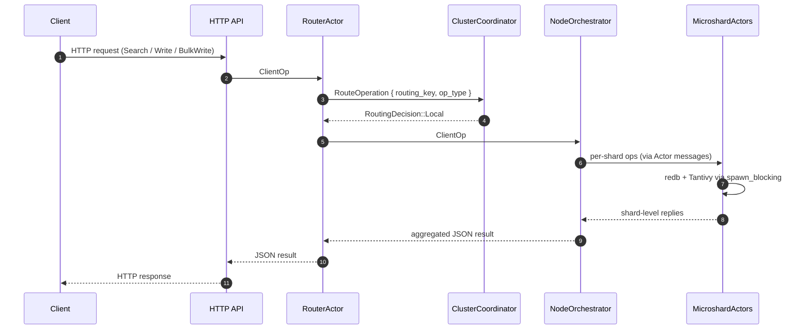
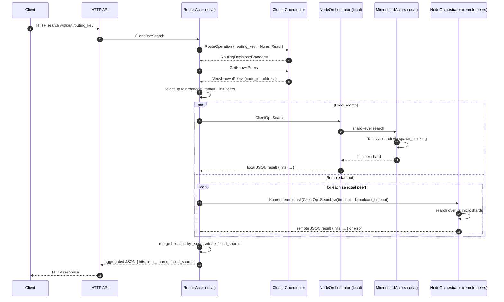

# CameoDB Server

The `server` crate hosts the CameoDB node process: a high-performance, actor-based database node that combines local hybrid storage (redb + Tantivy) with distributed coordination, routing, and remote execution over libp2p + Kameo.

This document focuses on the *server-side* architecture and the distributed workflows currently implemented.

---

## 1. Core Responsibilities

- **HTTP API surface**
  - Accepts client requests (search, write, bulk write, admin).
  - Translates them into strongly-typed operations (`ClientOp`).
- **Local orchestration**
  - Manages microshards (`MicroshardActor`) and their storage configuration.
  - Ensures all redb/tantivy I/O is executed via `tokio::task::spawn_blocking`.
- **Cluster coordination**
  - Manages the libp2p swarm and Kademlia DHT.
  - Tracks peer nodes, shard ownership, and consistent-hash routing.
- **Distributed execution**
  - Uses Kameo remote actors over libp2p to forward operations to remote nodes.
  - Implements scatter–gather broadcast for search and multi-node writes.

---

## 2. Main Actors & Data Flow

### 2.1 RouterActor

The `RouterActor` is the primary ingress for database operations on a node.

- Input: `ClientOp`, representing logical client operations:
  - `Search { index, query, limit }`
  - `Write { index, id, routing_key, doc }`
  - `BulkWrite { index, docs }`
- Responsibilities:
  - Ask the `ClusterCoordinator` for a routing decision:
    - `RoutingDecision::Local`
    - `RoutingDecision::Remote { node_id, peer_addr }`
    - `RoutingDecision::Broadcast`
  - Execute the chosen path:
    - Local → delegate to `NodeOrchestrator` on this node.
    - Remote → call `handle_remote` / `try_remote` with retries + timeouts.
    - Broadcast → fan out to local + remote nodes and aggregate results.
- Telemetry:
  - Tracks broadcast attempts and failures via `AtomicU64` counters.

### 2.2 NodeOrchestrator

`NodeOrchestrator` owns the node’s identity and all local shards.

- Fields:
  - `identity: NodeIdentity` (UUID, name, vnode tokens).
  - `shards: HashMap<Uuid, MicroshardActor>`.
  - `routing_ring: ConsistentRing` for shard placement.
- Startup:
  - Hydrates existing shards from disk.
  - Registers shard assignments with `ClusterCoordinator`.
- Message handling:
  - `Message<ClientOp>` delegates to `handle_client_op`, which:
    - Maps logical operations into local microshard operations.
    - Uses `spawn_blocking` for all redb/tantivy calls.
- Remote capability:
  - `#[derive(Actor, RemoteActor)]`.
  - `#[remote_message("cameo.orchestrator.client_op")] impl Message<ClientOp>` enables remote `ask`.

### 2.3 MicroshardActor

Each `MicroshardActor` manages a single shard’s data and index.

- Storage:
  - redb for durable KV and WAL.
  - Tantivy for full-text search.
- Remote messages:
  - `SearchRequest` → `Result<SearchReply, RemoteError>`.
  - `WriteRequest` → `Result<WriteReply, RemoteError>`.
  - `BatchWriteRequest` → `Result<BatchWriteReply, RemoteError>`.
- All storage operations are executed inside `spawn_blocking` to avoid blocking async executors.

### 2.4 ClusterCoordinator & DistributedCluster

`ClusterCoordinator` owns a `DistributedCluster` and exposes cluster operations via actor messages.

- Tracks:
  - `peer_nodes: HashMap<Uuid, NodeInfo>` (remote node id, address, status, shard_count).
  - `shard_assignments: HashMap<Uuid, ShardMetadata>` (which shards live on which nodes).
  - `ring: ConsistentRing` used for consistent hashing.
- Key messages:
  - `InitSwarm` / `ShutdownSwarm` for swarm lifecycle.
  - `DiscoverPeers`, `GetStatus` for cluster observability.
  - `RegisterLocalShards` + `rebuild_ring()` to maintain shard metadata.
  - `RouteOperation` → `RoutingDecision` for read/write routing.
  - `GetKnownPeers` → `Vec<KnownPeer>` for broadcast fan-out.

---

## 3. Networking & Remote Actors

### 3.1 Libp2p Swarm & Kademlia

The server builds a custom libp2p swarm with:

- TCP (nodelay), QUIC, Noise, Yamux.
- Kademlia DHT for peer discovery and routing metadata.
- Custom `DhtBehaviour`:
  - `kademlia: kad::Behaviour<MemoryStore>`.
  - `kameo: kameo::remote::Behaviour`.

After the swarm is built, the code calls:

```rust
swarm.behaviour_mut().kameo.init_global();
```

This wires Kameo’s remote registry into the swarm so actor lookups and remote messaging flow over libp2p.

### 3.2 Remote Actor Naming & Registration

To make nodes discoverable for remote calls, the server uses stable actor names:

- `orchestrator-{node_id}` for `NodeOrchestrator`.
- `shard-{shard_id}` for `MicroshardActor` (planned for direct shard-to-shard calls).

On startup, after `NodeOrchestrator` is spawned, the server:

1. Computes the name using `orchestrator_remote_name(node_id)`.
2. Calls `orchestrator_ref.register(name).await` to register with the Kameo registry.

### 3.3 Remote Call Path (`RouterActor::try_remote`)

When `ClusterCoordinator` decides that an operation should be routed to a remote node:

1. `RouterActor::handle_remote` applies retries and timeouts.
2. Each attempt calls `RouterActor::try_remote`:
   - Builds the orchestrator name from the target node’s UUID.
   - Uses `RemoteActorRef::<NodeOrchestrator>::lookup(name).await`.
   - On success, forwards the original `ClientOp` with `remote.ask(&op).await`.
3. Errors and timeouts are logged and converted into `OrchestratorError`.

This path reuses the same `ClientOp` semantics on remote nodes as on the local node.

---

## 4. Routing & Distribution Semantics

### 4.1 Single-Key Read/Write Routing

When a request has a `routing_key` (typically a document or tenant key):

1. `RouterActor` sends `RouteOperation { routing_key, operation_type }` to `ClusterCoordinator`.
2. `ClusterCoordinator::decide_route`:
   - Uses `ConsistentRing::get_owner(key)` to map key → `shard_id`.
   - Uses `shard_owner(shard_id)` to map `shard_id` → `node_id`.
   - Looks up node address in `peer_nodes`.
   - Returns:
     - `RoutingDecision::Local` if the owner node is the local node.
     - `RoutingDecision::Remote { node_id, peer_addr }` if a remote owner is known.
     - `RoutingDecision::Broadcast` if metadata is missing.
3. `RouterActor` executes the routing decision:
   - Local: calls `NodeOrchestrator` directly.
   - Remote: uses Kameo remote actors as described above.
   - Broadcast: falls through to scatter–gather.

This gives you single-owner semantics for keyed reads/writes across the cluster.

### 4.2 Broadcast / Scatter–Gather

When there is **no routing_key**, or the coordinator chooses `Broadcast` because of missing metadata, the router performs a scatter–gather:

1. Ask `ClusterCoordinator` for known peers via `GetKnownPeers`.
2. Select up to `broadcast_fanout_limit` peers.
3. Execute in parallel:
   - Local `handle_client_op` over local microshards.
   - Remote `try_remote` calls to selected peers, each wrapped in `timeout(broadcast_timeout, ...)`.
4. Aggregate results:
   - **Search**:
     - Collect `hits` arrays from all successful responses.
     - Merge into a single `hits` list.
     - Sort by `_score` descending.
     - Report `total_shards` and `failed_shards`.
   - **Write/BulkWrite**:
     - Report number of nodes contacted, succeeded, and failed.
   - Other operations:
     - Return first successful result or an aggregated failure.
5. Update `broadcasts_total` and `broadcast_failures` telemetry counters.

This implements a distributed search/read path suitable for fan-out queries across nodes while preserving timeouts and backpressure.

---

## 5. Error Handling & Telemetry

- **Error types**:
  - `OrchestratorError` for node-level orchestration failures.
  - `RemoteError` for remote microshard call failures.
  - Conversions are implemented so remote errors can be surfaced as orchestrator errors.
- **Retries & timeouts**:
  - Remote routing uses bounded retries (`remote_retry_attempts`) and per-attempt `remote_timeout`.
  - Broadcast uses `broadcast_timeout` per remote call.
- **Telemetry**:
  - Broadcast paths track:
    - Total broadcast attempts.
    - Broadcast failures (per failed shard/node).

---

## 6. Current Distributed Feature Coverage

The `server` crate currently supports:

- Local hybrid-search storage with per-shard actors and blocking I/O isolation.
- Clustered routing using consistent hashing and shard assignments.
- Remote execution of logical `ClientOp` operations on other nodes via Kameo + libp2p.
- Scatter–gather broadcast for unkeyed search and multi-node writes.
- Basic resilience hooks (retries, timeouts, bootstrap redial stub) and telemetry.

Planned future work includes:

- A dedicated remote registry/connector module to cache `RemoteActorRef`s.
- Remote registration and direct addressing of individual `MicroshardActor`s.
- Configurable fallback modes (e.g. local-only when remoting is disabled).
- Operational endpoints for cluster introspection and admin workflows.

---

## 7. Distributed Flows (Sequence Diagrams)

This section illustrates the main distributed workflows implemented by the `server` crate.

### 7.1 Local Read/Write



### 7.2 Remote Read/Write


### 7.3 Broadcast Search (Scatter–Gather)



