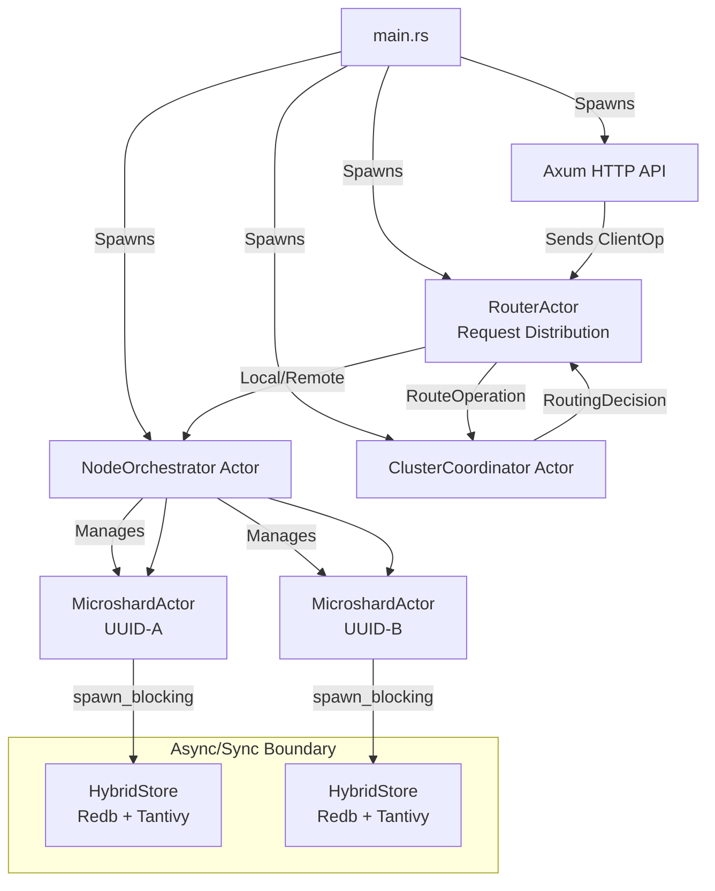
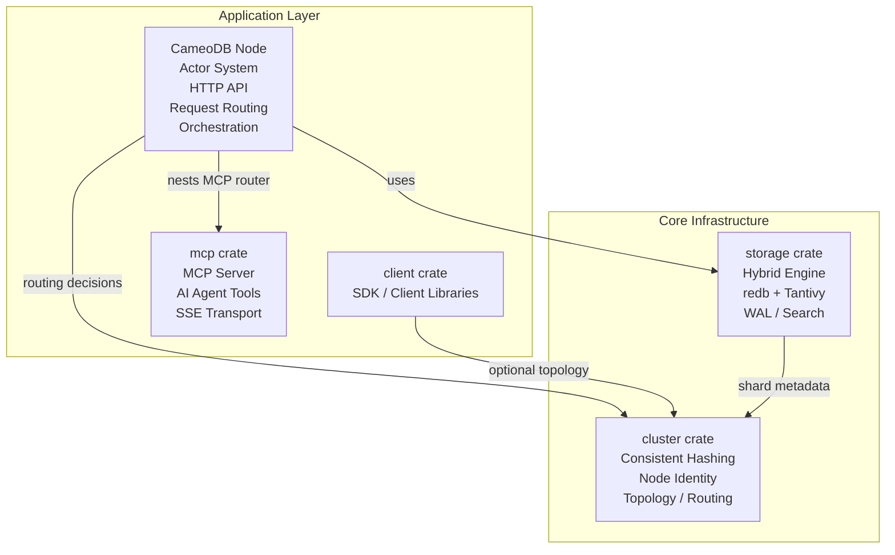

# Distributed Hybrid-Search Database: Architecture Design Document

**Version:** 0.2.2
**Stack:** Rust, Kameo (Actors), Tokio, Redb, Tantivy, Axum, Libp2p
**Crates:** `server`, `storage`, `cluster`, `client`, `mcp`

---

## 1. System Overview

This project is a high-performance, distributed, shared-nothing database and search engine. It utilizes a **Hybrid Storage Architecture** combining a Key-Value store (`redb`) for durability and raw data retrieval, with an Inverted Index engine (`tantivy`) for full-text search capabilities.

The system is designed without a central master ("Leaderless" / "Decentralized"), relying on **Consistent Hashing** and **Distributed Hash Tables (DHT)** for topology management.

### Key Architectural Principles
1.  **State is Emergent:** The cluster state is the aggregate of local states announced by nodes.
2.  **Hybrid Storage:** Every shard is an atomic unit containing both KV storage and Search Indices.
3.  **Smart Routing:** Clients participate in topology awareness; Nodes act as mesh routers.
4.  **Async/Sync Isolation:** Blocking storage operations are properly isolated from async actor runtime.
5.  **Unified Replication:** Migration and Rebalancing are treated as standard replication events.
6.  **Serializable Search:** Search results use JSON serialization for distributed actor communication.

---

## 2. Network Topology & Identity

### 2.1. Node Identity
Nodes are "Self-Sovereign." They do not request an ID from a master.
* **UUID (v4):** The immutable, cryptographic identity of the node.
* **Friendly Name:** A Base36 string derived from the first 2 bytes of the UUID (e.g., `7FX`).
* **Node Label:** A human-readable identifier configured via `node.label` (e.g., `cameodb-node-1`).
* **Storage:** Identity is generated on Cold Boot and persisted to `./data/cameodb/node_identity.json`.

### 2.2. The Ring (Consistent Hashing)
To ensure uniform data distribution without coordination:
* **Virtual Nodes (VNodes):** Each physical node generates 256 deterministic tokens (`hash(uuid + index)`).
* **Placement:** These tokens are placed on a `u64` hash ring.
* **Ownership:** A key belongs to the first VNode found clockwise on the ring.

### 2.3. Cluster Discovery
* **Mechanism:** Kameo + libp2p DHT used primarily during bootstrap to exchange shard metadata snapshots.
* **Bootstrap:** Nodes dial the configured seed list, publish their shard metadata (UUID, vnode tokens, storage stats), and query peer metadata keys.
* **Announcement:** Cluster state is exchanged via `PeerShardDiscovered`, `MergeRemoteShards`, and `ClusterStateResponse` messages inside `ClusterCoordinator` rather than a flat node list.
* **Registry:** Each coordinator persists the aggregated shard map + consistent ring locally, replaying it on restart for deterministic routing.
* **Ring Management:** Local consistent hashing with deterministic token generation; ring updates are broadcast to subscribers (e.g., `NodeOrchestrator`) via actor channels.

---

## 3. Node Architecture (The Actor System)

The internal structure of a node is hierarchical, managed by the Kameo Actor Framework.



### 3.1. The Node Orchestrator
* **Role:** Local Resource Manager and Parent.
* **Startup:** Scans `./data/cameodb/`. Detects existing shard directories (e.g., `shard-<uuid>`). Spawns `MicroshardActors` for them.
* **Lifecycle:** Handles `ProposeNewShard`, `GetStatus`, and `Shutdown` signals.
* **Resource Guard:** Enforces `max_shards` and disk usage limits before accepting new work.

### 3.2. The RouterActor
* **Role:** Request distribution and result aggregation across the cluster via actor messaging (no shared locks).
* **Routing Logic:**
    - Delegates every client op to `ClusterCoordinator::RouteOperation` to decide between **Local**, **Remote**, or **Broadcast** execution. Write ops are never broadcast.
    - **Remote fan-out:** Looks up remote `NodeOrchestrator` actors, retries with configurable backoff, and alerts the coordinator to redial seeds when routing fails.
    - **Scatter-Gather:** When broadcasting reads/searches, caps fan-out, enforces per-request timeouts, and can stream shard responses incrementally with early termination once limits are satisfied.
* **Async Patterns:** Integrates streaming NDJSON fan-in, remote retries, and topology updates without blocking, while keeping storage calls isolated inside shard actors.

### 3.3. The MicroshardActor
* **Role:** The atomic unit of data processing with strict async/sync isolation (spawn-blocking for `HybridStore`).
* **Threading Model:** All blocking storage operations use `tokio::task::spawn_blocking` to prevent async runtime blocking.
* **State Machine:**
    - **Hosting (current):** Active shard role handling reads/writes locally.

    - **Follower (planned):** Passive replica that replays WAL streams (replication roadmap).
    - **Forwarding (planned):** Soft-handoff role that forwards traffic during migration.

---

## 4. Storage Engine: The "Hybrid Shard"

To solve the trade-off between Search (Tantivy) and Retrieval (Redb), both engines run side-by-side within a Shard, letting Tantivy handle high-throughput indexing/query execution while redb keeps point lookups and WAL mutation costs predictable.

**Durability & Query Guarantees:** redb provides ACID durability for every document (WAL + crash-safe commits), while Tantivy offers specialized index structures (text, numeric/date fast fields, exact tokenizers) plus the standard Tantivy query syntax for expressive search.

**Directory Structure:**
```text
/data/cameodb/shard-{uuid}/
├── store.redb         # Redb database for KV data and WAL
└── indices/           # Root for multi-tenant Tantivy indices
    ├── {index_name_1}/  # Separate directory for each index
    └── {index_name_2}/  # ...
```

### 4.1. The Atomic Write Transaction
Writes are durable only if committed to Redb. Tantivy is treated as a "View."
1.  **Begin Redb Write Transaction.**
2.  **Insert Data:** Store generic JSON blob in `TABLE_DATA` (Key -> Blob).
3.  **Append Log:** Store operation in `TABLE_WAL` (SeqID -> `WalOp::Put`).
4.  **Commit Redb.** (Data is safe).
5.  **Update Tantivy:** Parse JSON, extract indexed fields, add to Inverted Index.

**Threading Isolation:** All redb and tantivy operations are executed via `tokio::task::spawn_blocking` when called from async actors to maintain runtime performance.

### 4.2. Schema Strategy
* **Schemaless Storage:** Redb stores the full original JSON document for maximum flexibility.
* **Dynamic Indexing:** The ingest pipeline automatically detects and processes field types:
    * `id` -> Primary Key (Redb)
    * `routing_key` -> Sharding Key for consistent hashing
    * `text_fields` -> Tantivy Text fields with standard tokenization
    * `numeric_fields` -> Tantivy FastField for range queries and aggregations

### 4.3. Search Result Serialization
**Design Challenge:** Tantivy documents must be serializable for distributed actor communication.

**Solution:** JSON-based serialization pipeline using tantivy's native conversion:
```rust
// Convert tantivy documents to JSON for network transmission
let doc: TantivyDocument = searcher.doc(doc_address)?;
let json_string = doc.to_json(&schema);  // Native tantivy serialization
let json_doc: JsonValue = serde_json::from_str(&json_string)?;
// Returns Vec<(f32, JsonValue)> - fully serializable for actor messages
```

**Architecture Benefits:**
- **Network Compatibility:** JSON format enables cross-language client support
- **Type Safety:** Maintains Rust's type system throughout the conversion pipeline
- **Performance:** Uses Tantivy's native JSON conversion to avoid redundant marshaling, keeping high-QPS search fan-out responsive
- **Durability:** Documents are serialized only after redb commits (WAL-backed), ensuring every hit represents fully durable state even during replication recovery.
- **Actor Integration:** `Vec<(f32, JsonValue)>` seamlessly integrates with Kameo message passing

---

## 5. Replication & Consistency

We utilize a **Unified Replication Model**. There is no distinct "Migration" code; migration is simply replication followed by a role switch.

### 5.1. The Protocol
1.  **Handshake:** Follower sends `CurrentSeqID`.
2.  **Snapshot (Cold):** If `CurrentSeqID == 0`, Leader streams:
    * Tantivy Segment Files (Immutable).
    * Redb Key/Value pairs (Iterated).
3.  **Catchup (Warm):** Leader streams live events from `TABLE_WAL`.
4.  **Synced:** Follower is within $N$ milliseconds of Leader.

---

## 6. API Interface (Tantivy-Native)

The system exposes a RESTful API built on **Axum**. It rejects the complexity of the Elasticsearch JSON DSL in favor of the direct **Tantivy Query Language**.

### 6.1. Search Endpoint
* **Method:** `POST /api/{index}/search`
* **Request Body:**
  ```json
  {
    "query": "description:\"distributed database\" AND stars: >500",
    "limit": 20,
    "routing_key": "optional_key_for_unicast"
  }
  ```
* **Routing Architecture:**
  - **Unicast Mode:** With `routing_key`, routes to specific shard via consistent hashing
  - **Scatter-Gather Mode:** Without `routing_key`, broadcasts across all shards and aggregates results. If `limit` is omitted, the configured `default_search_limit` is used.
* **Response Format:**
  ```json
  {
    "hits": [{"_score": 0.95, "title": "...", "body": "..."}],
    "hits_returned": 1,
    "total_hits": 42,
    "limit": 20,
    "total_shards": 4,
    "nodes_contacted": 1,
    "failed_shards": 0,
    "took_ms": 12
  }
  ```
* **Query Capabilities:** Full Tantivy query language including Boolean operators (`AND`, `OR`, `-`), Phrase queries (`"foo bar"`), Range queries (`[10 TO 20]`), and Fuzzy matching (`word~1`).

### 6.2. Ingestion Endpoint
* **Method:** `PUT /api/{index}/document`
* **Body:**
  ```json
  {
    "id": "user_123",
    "doc": { "name": "Alice", "role": "admin", "meta": { "login_count": 5 } }
  }
  ```
* **Logic:** The `id` is hashed to determine the target Shard (Unicast). The `doc` is stored raw in Redb and indexed dynamically in Tantivy.

---

## 7. Async/Sync Integration Architecture

### 7.1. Threading Model: Async/Sync Isolation
**Architectural Constraint:** `redb` and `tantivy` are blocking/synchronous libraries, while Kameo actors and Axum operate in async context.

**Design Solution:** Strict isolation boundary using `tokio::task::spawn_blocking`:

```rust
// ✅ CORRECT: Actor method properly isolates blocking calls
async fn handle_search(&self, request: SearchRequest) -> Result<Vec<(f32, JsonValue)>, Error> {
    let store = Arc::clone(&self.store);
    
    // Offload blocking tantivy operations to thread pool
    let results = tokio::task::spawn_blocking(move || {
        store.search_documents(&request.query, request.limit)
    }).await??;
    
    Ok(results) // Can be serialized and sent to other actors
}

// ❌ WRONG: This would block the entire async runtime
async fn bad_example(&self, request: SearchRequest) -> Result<Vec<(f32, JsonValue)>, Error> {
    self.store.search_documents(&request.query, request.limit) // BLOCKS ASYNC RUNTIME!
}
```

### 7.2. HybridStore Thread Safety
* **Design:** `HybridStore` implements `Arc<T> + Send + Sync` for safe sharing
* **IndexWriter:** Protected by `Arc<Mutex<IndexWriter>>` for concurrent access
* **Sequence Counter:** Lock-free `AtomicU64` for WAL sequence generation
* **Pattern:** Clone `Arc<HybridStore>` into blocking tasks

### 7.3. Actor Communication Patterns
```rust
// Scatter-gather search across multiple shards
let mut search_tasks = Vec::new();
for shard_id in &shard_ids {
    let task = tokio::spawn(async move {
        let results = shard.handle_search(search_request).await;
        (shard_id, results)
    });
    search_tasks.push(task);
}

// Aggregate results from all shards
let mut all_results = Vec::new();
for task in search_tasks {
    match task.await {
        Ok((shard_id, Ok(shard_results))) => {
            for (score, doc) in shard_results {
                all_results.push((score, doc, shard_id));
            }
        }
        Ok((shard_id, Err(e))) => warn!("Shard {} failed: {}", shard_id, e),
        Err(e) => warn!("Task failed: {}", e),
    }
}

// Sort by relevance score and return top results
all_results.sort_by(|a, b| b.0.partial_cmp(&a.0).unwrap_or(Ordering::Equal));
all_results.truncate(limit);
```

## 8. Modular Crate Architecture

### 8.1. Modular Design



### 8.2. Crate Responsibilities
- **`server`:** Actor system (Kameo + Libp2p), HTTP API (Axum), request routing, orchestration, admin endpoints, thread-per-core worker pool
- **`storage`:** Hybrid storage engine (redb + tantivy), WAL, search functionality, schema evolution
- **`cluster`:** Consistent hashing (XXH3), node identity, topology management
- **`client`:** SDK for application integration (HTTP client, CLI REPL)
- **`mcp`:** Model Context Protocol server for AI agents (SSE transport, JSON-RPC, tool definitions)

## 9. Resilience & Recovery

### 9.1. Cold Boot / Crash Recovery
1.  **Orchestrator** starts.
2.  **Local Hydration:** Reads `redb` for the last committed WAL Sequence ID.
3.  **Network Join:** Connects to DHT.
4.  **Reconciliation:**
    * Checks if it is still the owner of its shards in the Ring.
    * If yes, opens gates for writes.
    * If no (Cluster rebalanced while dead), enters `Forwarding` mode or deletes data (based on policy).

### 9.2. Zero-Downtime Migration (Soft Handoff)
1.  **Candidate** joins as Follower.
2.  **Sync** completes.
3.  **Orchestrator** issues `Promote`.
4.  **Old Leader** switches to `Forwarding` state (updates internal pointer).
5.  **New Leader** takes over.
6.  **DHT** is updated.
## 🧠 Distributed Architecture Overview

CameoDB is designed as a **distributed, shared-nothing cluster**:

- **Per-node storage** is handled by the `server` crate with actors (`NodeOrchestrator`, `MicroshardActor`) on top of redb + Tantivy.
- **Routing & clustering** use a `ClusterCoordinator` actor with a consistent hash ring and libp2p Kademlia DHT.
- **Remote execution** is powered by Kameo remote actors over a custom libp2p swarm (TCP/QUIC/Noise/Yamux, no mDNS).
- **Scatter–gather** search and multi-node writes are implemented via a `RouterActor` that fans out to peers and aggregates results.
- **Event-driven metadata** - Cluster state transitions and persistence triggered purely by actor messages (`PeerDiscovered`, `PeerLost`, `MergeRemoteShards`) with no background polling or timeouts.
- **State reconciliation** - On boot, nodes compare expected cluster topology from snapshots vs actual peer reports, logging discrepancies and converging to distributed reality.

For a detailed walkthrough of the node-side actors, routing decisions, remote flows, and metadata persistence, see:

- [`crates/server/README.md`](crates/server/README.md)

## � Operation Routing Workflows

Every client request follows the same top-level path: **HTTP handler → RouterActor → ClusterCoordinator routing decision → execute**. The routing decision determines whether the operation runs locally, is forwarded to a single remote node (unicast), or is fanned out to all nodes (broadcast).

### Routing Decision Logic

```
                         ┌──────────────────────┐
                         │  ClusterCoordinator  │
                         │  RouteOperation msg  │
                         └─────────┬────────────┘
                                    │
                         routing_key present?
                           ┌────────┴────────┐
                          YES                NO
                           │                 │
                    Hash ring lookup    RoutingDecision::
                           │              Broadcast
                    owner == local?
                     ┌─────┴─────┐
                    YES          NO
                     │           │
              RoutingDecision  RoutingDecision::Remote
                ::Local        { node_id, peer_addr }
```

- **Local**: The owning shard lives on this node. Execute directly.
- **Remote**: The owning shard lives on another node. Forward via cached `RemoteActorRef`.
- **Broadcast**: No routing key (e.g. search). Fan out to local + all known peers, merge results.

### Read (Search) Workflow

Searches have no routing key, so they always broadcast to gather results from all nodes.

```
HTTP POST /api/{index}/search
  │
  ▼
RouterActor::route_and_handle(routing_key=None)
  │
  ▼ RoutingDecision::Broadcast
  │
  ├── LOCAL ──→ Worker Pool (or actor mailbox fallback)
  │               └── OrchestratorEngine::orch_search()
  │                     └── Fan out to all local MicroshardActors
  │                           └── spawn_blocking { store.search() }
  │
  └── REMOTE (per peer, up to fanout_limit) ──→ try_remote()
        │
        ▼
      RemotePeerPool::get_orchestrator(node_id)    ◄── cache hit: O(1)
        ├── RwLock read → HashMap lookup           ◄── cache miss: swarm lookup, then cached
        │
        ▼
      remote_ref.ask(&ClientOp::Search)
        │
        ▼
      Remote node executes same local search path
        │
        ▼
  ┌────────────────────────────────────────────┐
  │  Merge: bounded score-aware top-K merge,   │
  │  then truncate to the requested limit      │
  └────────────────────────────────────────────┘
```

**Key characteristics:**
- Concurrent local + remote execution via `tokio::join!`
- Bounded shard and remote fan-out using configured concurrency limits
- Score-aware top-K merge keeps the strongest hits even when better remote results arrive later
- Configurable `broadcast_timeout` and `broadcast_fanout_limit`
- Streaming search variant available (`/search/stream`) returning NDJSON

### Write (Single Document) Workflow

Single writes always have a routing key (defaults to `doc.id`), so they are unicast to the owning node.

```
HTTP PUT /api/{index}/document
  │
  ▼
RouterActor::route_and_handle(routing_key=Some(doc.id))
  │
  ▼ Hash ring lookup → shard owner
  │
  ├── RoutingDecision::Local
  │     │
  │     ▼
  │   Worker Pool (Write is hot-path eligible)
  │     └── OrchestratorEngine::orch_write()
  │           └── Route to specific MicroshardActor via hash ring
  │                 └── writer_thread → redb WAL + Tantivy index
  │
  └── RoutingDecision::Remote { node_id, peer_addr }
        │
        ▼
      RouterActor::handle_remote() ──→ retry loop (configurable attempts)
        │
        ▼
      RouterActor::try_remote()
        │
        ▼
      RemotePeerPool::get_orchestrator(node_id)    ◄── cached lookup
        │
        ▼
      remote_ref.ask(&ClientOp::Write)
        │
        ▼
      Remote node executes same local write path
```

**Key characteristics:**
- Writes are **never broadcast** — the router rejects broadcast routing for writes
- Retry with configurable `remote_retry_attempts` and `remote_timeout`
- On repeated failure, triggers `RequestBootstrapRedial` to recover connectivity
- Each shard has a dedicated writer thread (no lock contention)

### Bulk Write Workflow

Bulk writes are the most complex path: documents are routed individually, then grouped by owning node for batched forwarding.

```
HTTP POST /api/{index}/_bulk
  │
  ▼
RouterActor::route_and_handle(routing_hint=first_doc.id)
  │
  ▼ Routed to one node (usually local for the first doc)
  │
  ▼
NodeOrchestrator::orch_bulk_write(index, docs[])
  │
  ├── 1. Schema Resolution
  │     └── Fingerprint cache → shard fallback
  │
  ├── 2. Staged Schema Validation
  │     └── Parallel Rayon validation + sequential evolution
  │
  ├── 3. Per-Document Routing (spawn_blocking + Rayon par_iter)
  │     └── For each doc: hash(routing_key) → ConsistentRing → target shard
  │
  ├── 4. Separate Local vs Remote
  │     ├── shard in self.shards → local_docs
  │     └── shard owned by other node → remote_docs (grouped by node_id)
  │
  ├── 5. Phase 3.1: Parallel Local Shard Processing
  │     └── Per-shard MicroshardActor::write_batch()
  │           └── writer_thread → redb WAL + Tantivy index
  │
  └── 6. Phase 3.2: Parallel Remote Forwarding (futures::join_all)
        │
        for each (node_id, docs_for_remote):
          │
          ▼
        NodeOrchestrator::forward_bulk_to_remote()
          │
          ▼
        RemotePeerPool::get_orchestrator(node_id)    ◄── cached lookup
          │
          ▼
        remote_ref.ask(&ClientOp::BulkWrite)
          │
          ▼
        Remote node runs orch_bulk_write() (recursive, same path)
```

**Key characteristics:**
- Documents are individually routed then batched by destination node
- Local and remote processing run in parallel
- Schema validation happens once on the entry node before routing
- Remote forwarding uses the same `RemotePeerPool` cache as other operations

### Connection Pool & Cache Invalidation

The `RemotePeerPool` eliminates repeated swarm registry/DHT lookups on every remote operation:

```
                    ┌───────────────────────────────────┐
                    │         RemotePeerPool            │
                    │  RwLock<HashMap<(Uuid, Channel),  │
                    │         RemoteActorRef>>          │
                    ├───────────────────────────────────┤
                    │  get_orchestrator(node, channel)  │──→ cache hit: clone ref
                    │  get_coordinator(node)            │──→ cache miss: lookup + cache
                    │  invalidate_peer(node)            │──→ evict all refs for node
                    │  invalidate_all()                 │──→ full cache clear
                    └───────────────────────────────────┘
                                    ▲
                                    │ invalidate_peer()
                    ┌───────────────┴───────────────┐
                    │  ClusterCoordinator           │
                    │  handle(PeerLost { node_id }) │
                    └───────────────────────────────┘
                                    ▲
                                    │ swarm event
                              Peer disconnected
```

**Integration points:**

| Call Site | Lookup Type | Purpose |
|---|---|---|
| `RouterActor::try_remote` | Orchestrator | Routed single operations (search, write) |
| `NodeOrchestrator::forward_bulk_to_remote` | Orchestrator | Bulk write forwarding |
| `ClusterCoordinator::exchange_shards_with_peer` | Coordinator | Shard metadata exchange |
| `ClusterCoordinator` stability sync | Coordinator | Post-bootstrap shard push |
| `ClusterCoordinator` peer discovery | Coordinator | New peer shard fetch |
| `ClusterCoordinator` delete forwarding | Orchestrator | Cross-cluster index deletion |

