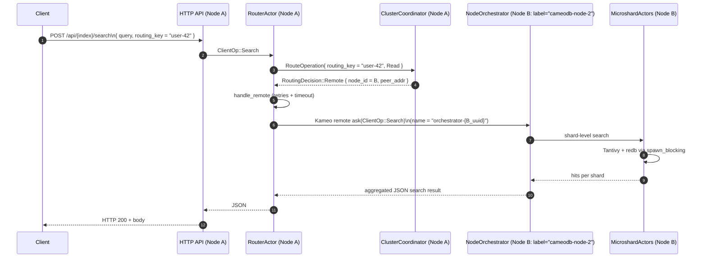

# CameoDB Documentation

This directory contains high-level documentation for CameoDB, focusing on clustered behavior and distributed flows.

---

## Search with routing key across 3 nodes

This section walks through a concrete distributed use case: a **Search with a routing key in a 3-node cluster**.

Assumptions:

- Nodes: `A`, `B`, `C`.
- Client talks to node `A` (ingress node).
- `routing_key = "user-42"`.
- The consistent hash ring says shard `S` (owning this key) lives on node `B`.

### Sequence: Search with routing key (ingress A → owner B)



### 1. HTTP → RouterActor on node A

1. Client sends an HTTP search request to node A:

   - `POST /api/{index}/search`
   - Body includes `routing_key: "user-42"` and `query`.

2. The HTTP handler constructs a `ClientOp` (simplified):

   ```rust
   ClientOp::Search {
       index,
       query,
       limit,
       // routing_key included as part of the request payload
   }
   ```

3. The handler forwards the operation into the actor system on node A:

   ```rust
   RouterActor::handle_client_op(self.router.clone(), client_op).await
   ```

### 2. Routing decision via ClusterCoordinator

Inside `RouterActor::handle_client_op`, the router delegates to `route_and_handle`, which asks the `ClusterCoordinator` how to route the operation.

1. The router sends a `RouteOperation` message:

   ```rust
   let decision: RoutingDecision = coordinator
       .ask(RouteOperation {
           routing_key: Some("user-42".to_string()),
           operation_type: OperationType::Read,
       })
       .await?;
   ```

2. In `ClusterCoordinator::decide_route`:

   - `route_for_key("user-42")` uses the `ConsistentRing` to map the key → `shard_id`.
   - `shard_owner(shard_id)` maps the shard → `node_id` (node B).
   - `node_address(node_id)` looks up the node’s address in `peer_nodes`.

   Result:

   ```rust
   RoutingDecision::Remote { node_id: B, peer_addr }
   ```

3. This `RoutingDecision` is returned to `RouterActor` on node A.

### 3. Remote execution via RouterActor::handle_remote & try_remote

The router sees a remote decision and calls `handle_remote`:

```rust
self.handle_remote(op, node_id, peer_addr).await
```

This node_id is the unique UUID of the remote node.

`handle_remote`:

- Applies bounded retries (`remote_retry_attempts`).
- Wraps each attempt in a `remote_timeout` using `tokio::time::timeout`.
- On each attempt, it calls `try_remote`.

`try_remote` performs the actual remote call:

```rust
let orchestrator_name = orchestrator_remote_name(&node_id); // "orchestrator-{uuid}"
let remote_ref: Option<RemoteActorRef<NodeOrchestrator>> =
    RemoteActorRef::lookup(orchestrator_name.clone()).await?;

match remote_ref {
    Some(remote) => {
        let result = remote.ask(&op).await?; // op is ClientOp::Search
        Ok(result)
    }
    None => { /* log + return OrchestratorError */ }
}
```

Key points:

- `RemoteActorRef::lookup` uses the **Kameo remote registry**, which is backed by the libp2p + `kameo::remote::Behaviour` integrated in the swarm.
- The registry knows that `"orchestrator-{B_uuid}"` lives on node B, so it delivers the `ClientOp` there.

### 4. Node B: NodeOrchestrator handles the search

On node B, the Kameo runtime delivers the remote `ClientOp` to `NodeOrchestrator` via a remote message handler:

```rust
#[remote_message("cameo.orchestrator.client_op")]
impl Message<ClientOp> for NodeOrchestrator {
    type Reply = Result<serde_json::Value, OrchestratorError>;

    async fn handle(
        &mut self,
        msg: ClientOp,
        _ctx: &mut Context<Self, Self::Reply>,
    ) -> Self::Reply {
        self.handle_client_op(msg).await
    }
}
```

`NodeOrchestrator::handle_client_op` on node B:

- Interprets `ClientOp::Search`.
- Uses its own `routing_ring` and shard metadata to determine **which local microshards** to search.
- Dispatches search requests to the appropriate `MicroshardActor`s.

Each `MicroshardActor` on B:

- Executes Tantivy search via `tokio::task::spawn_blocking`, reading from its local `HybridStore`.
- Returns per-shard hits (`SearchReply`).

The remote `NodeOrchestrator` aggregates all shard results into a JSON payload shaped for the router.

### 5. Response flows back to node A and to the client

1. Node B’s `NodeOrchestrator` returns the aggregated JSON to the remote `ask` call.
2. The result travels back over libp2p/Kameo to `RouterActor::try_remote` on node A.
3. `try_remote` returns to `handle_remote`, which returns to `route_and_handle`, which in turn returns from `handle_client_op`.
4. The HTTP handler serializes the `JsonValue` result and sends it back to the client as an HTTP response.

From the client’s perspective:

- It issued a **single HTTP request** against node A.
- Internally, the system:
  - Used the **consistent-hash ring** to identify node B as the owner for `routing_key = "user-42"`.
  - Forwarded the logical `ClientOp::Search` to node B using **Kameo remote actors over libp2p**.
  - Node B performed the search across its local shards and returned the aggregated hits.

For more context and additional flows (local-only and broadcast search), see:

- [`crates/server/README.md`](../crates/server/README.md)
